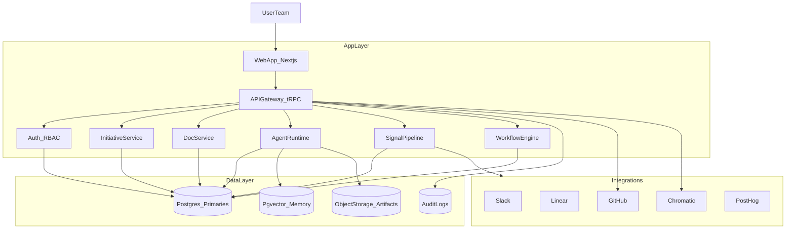

# Greenfield Team App Plan (Product MVP)

Date: 2026-02-01
Time horizon: 3–6 months
Approach: Full rebuild (no runtime reuse), reuse specs/prompts/docs as assets

## Goal

Build a SaaS-ready, multi-tenant Elmer application that delivers discovery compression through multi-agent workflows, prototype-first validation, and human-controlled automation.

## Target Architecture

## Core Data Model (Greenfield)

- **Team**: tenant boundary and settings
- **User**: identity, role, permissions
- **Agent**: identity, persona, model, tools, memory policy
- **AgentConfig**: team-specific overrides and templates
- **AgentRun**: run metadata, tool traces, outputs, costs
- **AgentThread**: conversation state and memory window
- **Initiative**: phase, status, docs, artifacts, validation state
- **Artifact**: doc/prototype/validation file with provenance
- **Signal**: source, classification, routing level, linked initiatives
- **Integration**: provider tokens/scopes + team settings
- **Memory**: vector embeddings and summaries for retrieval

## MVP Scope (3–6 Months)

### P0 (Must Have)

- **Multi-tenant auth + RBAC**
- **Initiative lifecycle** (discovery -> validate)
- **Planner/Worker/Judge loop** with structured outputs
- **Agent Library** with per-team configuration
- **Signal ingestion** (Slack + transcripts)
- **Repo-first artifacts** (writeback to GitHub)
- **Prototype embedding** (Storybook/Chromatic)
- **Validation gating** (jury results block advance)

### P1 (Should Have)

- **Linear shipping** (project/issue creation)
- **PostHog metrics gating**
- **Notion publishing**
- **Team analytics dashboard**

### Deferred

- Marketplace for agent templates
- Live co-editing for docs
- Full billing/usage dashboards

## Agent Runtime (Greenfield)

### Core capabilities

- **Model orchestration**: multiple models per agent
- **Tool execution**: typed tools with audit trails
- **Run tracing**: inputs, outputs, tool calls, costs
- **Memory**: vector and conversation memory with policies

### A2UI UX requirements

- **Presence**: agent identity, role, status, confidence
- **Transparency**: tool traces, citations, step-by-step reasoning
- **Control**: pause, override, automation level per phase
- **Collaboration**: multiple agents working in a shared run panel

## Signal Pipeline (Greenfield)

1. **Ingest**: webhook intake for transcripts + Slack polling
2. **Router**: classify signals into L1–L4 with reasoning
3. **Initiative runner**: L3 auto-creates initiative and runs research -> PRD -> proto -> validate
4. **Escalation**: L4 requires explicit approval before shipping
5. **Digests**: daily summaries and alerts

## Principles Checklist

- Discovery compression is explicit in every workflow
- Prototype-first truth is mandatory for validation
- Human-in-the-loop control at each stage
- Anti-vision guardrails enforced in plan generation
