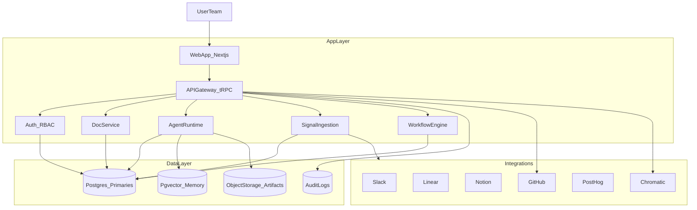

# Team App Implementation Snapshot (Product-Grade MVP)

Date: 2026-02-01
Scope: Product-grade MVP for a multi-tenant team application (SaaS-ready)

## Summary

This is the "implemented today" view of Elmer as a full team application: a multi-tenant, multi-agent PM platform that compresses discovery to validated prototypes. It assumes A2UI-grade agent experiences, a dedicated agent runtime, repo-first artifacts, and end-to-end workflows from signals to validation. It preserves the core vision: discovery compression, human-in-the-loop control, iterative loops, and prototype-first truth.

## Experience Overview

### Primary surfaces

- **Team Dashboard**: activity feed, signals, active initiatives, and automation health.
- **Agent Library**: browse and configure agents (role, model, tools, memory).
- **Initiative Board**: discovery -> define -> build -> validate -> launch, with visible loops.
- **Agent Run Timeline**: step-by-step reasoning, tools used, outputs and artifacts.
- **Doc Studio**: PRD/design/eng/gtm with embedded artifacts and citations.
- **Prototype Player**: embedded Storybook/Chromatic with feedback capture.

### A2UI Patterns

- **Agent presence**: named identities, avatar, role, status, confidence.
- **Transparency**: thinking panels, tool calls, evidence and citations.
- **Control**: pause, override, adjust automation level per phase.
- **Collaboration**: multiple agents can run in a visible team panel.

## System Architecture (Implemented Now)

## Core Data Model

- **Team / Workspace**: org boundary and permissions.
- **User / Membership**: roles, access, audit trails.
- **Agent**: identity, persona, model, tools, memory policy.
- **AgentConfig**: team-level overrides and templates.
- **AgentRun / Thread**: conversation history, outputs, tool traces.
- **Initiative**: lifecycle state, docs, prototypes, validation status.
- **Artifacts**: docs, prototypes, validation reports, provenance.
- **Signals**: source, classification, routing level, linked initiatives.
- **Integrations**: tokens, scopes, and sync settings.
- **Memory**: vector embeddings and summary memory.

## Implemented Workflows

### 1) Planner / Worker / Judge Loop

- Planner decomposes goals into tasks.
- Worker agents execute tasks with structured outputs.
- Judge evaluates, iterates, or blocks with explicit criteria.

### 2) Signal-Driven Autonomy

- Signals auto-ingested (Slack, HubSpot, Linear, transcripts).
- Router assigns L1/L2/L3 level with reasoning.
- L3 triggers autonomous initiative: research -> PRD -> proto -> validate.
- L4 requires explicit approval to ship to Linear/engineering.

### 3) Transcript Ingestion

- AskElephant transcript webhook -> intake queue -> signal router -> initiative.
- Role-aware extraction and scoring (product research, renewal, etc).

### 4) Prototype-to-Validation Loop

- Prototype generation with multiple directions and states.
- Embedded prototype player with feedback capture.
- Jury system validates, gating move to build/launch.

## Multi-Tenant SaaS Capabilities (MVP)

- **Auth and RBAC**: teams, roles, permissions, and audit logs.
- **Isolation**: data isolation per team, no context bleed.
- **Usage Tracking**: cost and run metrics per team/agent.
- **Safety**: approvals on high-risk actions (shipping, external comms).

## Integrations (MVP)

- **GitHub**: repo-first writeback for artifacts and code.
- **Chromatic**: prototype previews and sharing.
- **Slack**: digests, escalation, approvals.
- **Linear**: ticket creation from validated initiatives.
- **PostHog**: metrics lifecycle from alpha -> beta -> GA.

## Experience Details

### Initiative board

- Each column has automation settings and default agents.
- Loop indicators show validation feedback cycles.
- Each card shows confidence, blockers, and evidence strength.

### Agent runs

- Live streaming and tool traces.
- Evidence citations link to signals and docs.
- Full audit log for compliance and retracing decisions.

## MVP Boundaries

Included:

- Multi-tenant auth and RBAC
- Configurable agents and tools
- Signal-driven workflow
- Prototype embedding and validation gating

Deferred:

- Marketplace for public agent templates
- Live co-editing in docs
- Fine-grained billing and usage dashboards

## Alignment With Product Vision

This implementation directly supports discovery compression, prototype-first truth, and configurable automation. It avoids anti-vision pitfalls by requiring working prototypes for validation and maintaining human-in-the-loop control over key transitions.
