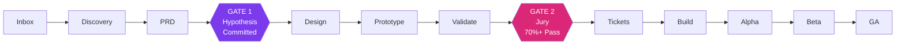

# FigJam Diagram: Elmer Kanban Flow
## Leave-Behind for Developer Training

**How to import into FigJam:**
1. Open FigJam at figjam.new
2. Click `+` button in the toolbar → search "Mermaid" → select the Mermaid plugin
3. Paste the code block below and click "Import"
4. After import: manually color the Gate diamonds using AskElephant brand colors

---

## Mermaid Code (FigJam import)

```mermaid
flowchart LR
  A["📥 Inbox\nRaw signals\ntranscripts, tickets, ideas"] --> B["🔍 Discovery\n/research /hypothesis /synthesize\nNeeds 3+ evidence sources"]
  B --> C["📄 PRD\n/PM command\nprd.md + design-brief.md\n+ engineering-spec.md"]
  C --> G1{{"GATE 1\nHypothesis Committed\n✓ 3+ evidence sources\n✓ Named persona\n✓ Strategic alignment\n\nThis is PM's gate"}}
  G1 --> D["🎨 Design\n/design command\nAll states defined\nTrust considerations"]
  D --> E["🛠 Prototype\n/proto command\n2-3 options built\nAll 6 states interactive\nChromatic deployed"]
  E --> F["✅ Validate\n/validate command\n100+ synthetic users\nCondorcet jury system"]
  F --> G2{{"GATE 2\nJury ≥70%\n✓ Prototype validated\n✓ Engineering spec ready\n✓ Storybook stories complete\n\nYour gate"}}
  G2 --> H["🎫 Tickets\nLinear project created\nEach ticket → Storybook story\nPostHog events specified\n4-8h chunks"]
  H --> I["⚙️ Build\nAI agent or manual\nImplement against story\nChromatic visual check"]
  I --> J["🔬 Alpha\nFeature-flagged\nInternal users\nError rate < 5%"]
  J --> K["🚀 Beta\nExpanded rollout\n10% → 25% → 50% → 75%\nMetrics gate"]
  K --> L["🟢 GA\nFull rollout\nOngoing metrics\nSub-feature loop"]

  B <--> C
  C <--> D
  D <--> E
  E <--> F

  I <--> J
  J <--> K

  H -.->|"Engineers receive"| DELIV["📦 Gate 2 Deliverables\n\nprd.md\nengineering-spec.md\nChromatic URL\nLinear tickets → Storybook"]

  LOOP1["← PM iterates here\nbefore you see it\n(cheap: pixels + markdown)"]
  LOOP2["← Engineering iterates here\nwith validated spec as anchor\n(expensive: deployed code)"]

  style G1 fill:#7c3aed,color:#fff,stroke:#7c3aed,stroke-width:2px
  style G2 fill:#db2777,color:#fff,stroke:#db2777,stroke-width:3px
  style DELIV fill:#0d9488,color:#fff,stroke:#0d9488,stroke-width:2px
  style LOOP1 fill:#1e293b,color:#94a3b8,stroke:#334155,stroke-dasharray:5
  style LOOP2 fill:#1e293b,color:#94a3b8,stroke:#334155,stroke-dasharray:5
  style H fill:#1e1b4b,color:#a5b4fc,stroke:#7c3aed
  style I fill:#1e1b4b,color:#a5b4fc,stroke:#7c3aed
  style J fill:#1e1b4b,color:#a5b4fc,stroke:#7c3aed
  style K fill:#1e1b4b,color:#a5b4fc,stroke:#7c3aed
  style L fill:#064e3b,color:#6ee7b7,stroke:#059669
```

---

## Manual FigJam Styling (after Mermaid import)

Apply these brand colors to specific nodes:

| Node | Color | Hex |
|------|-------|-----|
| Gate 1 diamond | Purple | `#7c3aed` |
| Gate 2 diamond | Pink/Magenta | `#db2777` |
| Gate 2 deliverables callout | Teal | `#0d9488` |
| Engineering stages (Tickets → GA) | Deep indigo | `#1e1b4b` |
| GA stage | Dark green | `#064e3b` |
| PM stages (Inbox → Validate) | Slate | `#1e293b` |
| Background canvas | Near-black | `#0f172a` |

---

## Tool Connections Row (add below the main flow in FigJam)

Create four sticky notes or shapes below the main flow, connected with dashed lines to the relevant stages:

| Tool | Connects to | Label |
|------|-------------|-------|
| **Linear** | Tickets stage | "Auto-generates tickets from validated prototype. Each ticket → Storybook story." |
| **GitHub** | PRD stage | "Every artifact committed atomically. git log = decision history." |
| **Storybook / Chromatic** | Prototype stage | "Stories deployed automatically. Chromatic baseline = visual regression test." |
| **Cursor AI** | Build stage | "Ticket + Storybook ref + engineering spec = AI-implementable." |

---

## Title Block for FigJam

**Title (large text at top):**
> Elmer: How Product Work Reaches Engineering

**Subtitle:**
> The two gates that protect engineering time

**For the left loop annotation, add a FigJam curved arrow spanning Discovery ↔ Validate labeled:**
> "PM iterates here — iteration is cheap (pixels + markdown, not code)"

**For the right loop annotation, add a FigJam curved arrow spanning Build ↔ Beta labeled:**
> "Engineering iterates here — with a validated spec as anchor"

---

## Simplified Version (for 1-page leave-behind printout)

**Caption to put below simplified version:**
> Gate 1 = hypothesis committed (PM's responsibility)
> Gate 2 = jury ≥70% (what guarantees you get a validated prototype with every ticket)
