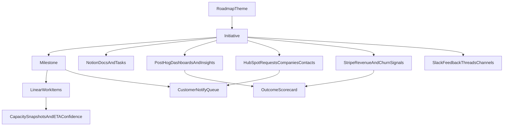

# ~~Unified Product Command Center & Notion Synthesis~~ [SUPERSEDED]

> **SUPERSEDED by `../runbooks/notion-v2-implementation-guide.md` (2026-02-23)**
> The V2 4-layer structure replaces this synthesis doc. See the new guide for current architecture and DB IDs.

**Created:** 2026-02-21  
**Purpose:** ~~Unified execution spec for Product teamspace cleanup.~~ DEPRECATED — replaced by V2 implementation.

---

## 1. Core Problem & Target Architecture

The Product teamspace sidebar is overloaded, and we lack a **unified execution graph**. We need to connect roadmap planning with delivery status, customer demand, and measurable usage/revenue outcomes. 

**Target Architecture:**


---

## 2. Guiding Principles

| Principle | Implication |
|-----------|-------------|
| **Product Home = dashboard, not storage** | Product Home is the entry point. Storage lives in databases. |
| **Sidebar = few hubs; discovery = linked views** | Don't browse folders. Filter and search databases. |
| **Unified Hierarchy** | Roadmap Theme → Initiative → Milestone → Linear Work |
| **Outcome-Driven** | Every initiative connects to PostHog usage and Stripe revenue metrics. |
| **Customer-Linked** | Every initiative connects to HubSpot requesters for GTM follow-up. |

---

## 3. Target Sidebar Structure

**Inside Product teamspace, show only:**

```
Product (teamspace)
├── Product Home          ← Dashboard (linked views, quick links)
├── Product System        ← Single page with all linked database views
└── Archive               ← Completed/deprecated initiatives & docs
```

Hide raw database pages from sidebar/favorites. Favorite only Product Home and Product System for daily use.

---

## 4. Canonical Data Model in Notion

This section defines the unified Notion hierarchy, ownership fields, and cross-tool relations.

### A. Initiatives Database (Core Source of Truth)

Extend the existing `Projects` database.

| Property | Type | Purpose |
|----------|------|---------|
| Title | Title | Initiative Name |
| Roadmap Theme | Relation | → Roadmap |
| Parent Initiative | Relation (self) | Sub-initiatives (e.g., Chief of Staff → daily-brief) |
| Phase | Select | Discovery, Define, Build, Validate, Launch, Done, Archived |
| Priority | Select | P0–P3 |
| Pillar | Select | customer-trust, etc. |
| Target Launch | Date | Target date for completion |
| **Ownership** | | |
| PM Owner | Person | Product Manager |
| Eng Lead | Person | Engineering Lead |
| Design Lead | Person | Design Lead |
| Revenue Lead | Person | Revenue/GTM Lead |
| **Cross-Tool Links & Outcomes** | | |
| Linear Project | URL | Link to Linear project |
| Slack Channel | URL | Main project channel |
| Baseline | Number | Current metric state |
| Target | Number | Goal metric state |
| Actual | Number | Current observed state |
| Confidence | Select | High, Medium, Low, At Risk |
| Outcome Status | Select | On Track, Needs Attention, Off Track |
| % Core Docs Complete | Rollup | Documents completion percentage |
| Open Launch Blockers | Rollup | From Launch Planning or formula |

### B. Milestones Database (New)

Tracks delivery milestones and acts as the bridge to Linear execution.

| Property | Type | Purpose |
|----------|------|---------|
| Title | Title | Milestone Name |
| Initiative | Relation | → Initiatives |
| Target Date | Date | Planned release date |
| Status | Select | Planned, In Progress, Shipped, Delayed |
| Linear Milestone | URL | Linear milestone link |
| ETA Confidence | Select | High, Medium, Low (Driven by forecast) |

### C. Documents Database (Single Source for Definition Work)

Replaces scattered standalone pages.

| Property | Type | Purpose |
|----------|------|---------|
| Title | Title | Document name |
| Initiative | Relation | → Initiatives |
| Doc Type | Select | PRD, Research, Design Brief, Engineering Spec, Decisions, Prototype Notes, GTM Brief, Metrics, Competitive Landscape, Placement Research, Validation Report, Build Report, Transcript, Iteration Spec, Customer Story, Design Review, Initiative Map, Source Packet, Analysis, Handoff, Other |
| Stage | Select | Draft, In Progress, Review, Approved, Obsolete |
| Canonical | Checkbox | Source of truth when multiple versions exist |
| Parent Doc | Relation (self) | For nested docs |
| Source | Select | `notion`, `local`, `linear` |
| URL | URL | External (PM workspace path) |
| Version | Text | v1, v2, etc. |
| Owner | Person | |

*(Keep Engineering Specs and Design Briefs as separate DBs for now due to rich existing schemas, but ensure they relationally link to Initiatives).*

### D. Junction Databases (Connecting Customers & Metrics)

**Customer Requests**
Connects work to customer demand for GTM notification loops.
| Property | Type | Purpose |
|----------|------|---------|
| Title | Title | Request summary |
| Initiative/Milestone | Relation | → Initiatives or Milestones |
| HubSpot Company | URL/Text | Requesting account |
| HubSpot Contact | URL/Text | Requesting user |
| Slack Signal | URL | Original feedback thread |
| Status | Select | Logged, Addressed, Notified |

**Metric Links**
Connects work to usage and revenue dashboards.
| Property | Type | Purpose |
|----------|------|---------|
| Title | Title | Metric description |
| Initiative/Milestone | Relation | → Initiatives or Milestones |
| PostHog Dashboard | URL | Usage tracking |
| Stripe Metric | URL/Text | Revenue/Churn/Expansion signal |
| Impact Delta | Text | E.g., +25% usage |

---

## 5. Command Views (Notion Dashboards)

### Product Home Dashboard
1. **Outcomes Cockpit** — Target vs actual (usage + revenue), by owner and theme.
2. **Roadmap with Confidence** — Initiative/milestone ETA, confidence bands, dependency risks.
3. **Recent Documents** — Linked view of Documents, sort by Last Updated.
4. **Missing Core Docs** — Initiatives where PRD or Research is Draft/missing.
5. **Quick links** — Product System, Archive.

### Product System Hub
Single page with comprehensive linked views:
- **Who’s Working On What** — Eng/design/revenue ownership and workload at initiative/milestone level.
- **Customer Impact Queue** — Accounts/contacts requesting shipped or in-progress work.
- **Release Impact** — Milestone shipped → PostHog deltas + Stripe deltas.
- **Initiatives by Phase**
- **Documents by Type**
- **Launch Tracker**

---

## 6. Migration & Rollout Plan

### Phase 1: Data Model and Notion Relations
1. Create/update **Initiatives**, **Milestones**, **Documents**, **Customer Requests**, **Metric Links** DBs.
2. Add ownership and outcome fields.

### Phase 2: View Layer
1. Build Product Home and Product System.
2. Collapse sidebar.

### Phase 3: Sync Contracts + Ingestion
*(See sync schema specifications in skills & meta.json).*

### Phase 4: Lightweight Forecasting
- Weekly capacity snapshot from Linear historical completion rates.
- Compute ETA confidence bands.

### Phase 5: GTM Notification Loop
- Target lists generated from Customer Requests when milestone is shipped.

---

## 7. Success Criteria

- Any roadmap item can be traced in one click to: owners, milestones, Linear work, docs, customer demand sources, usage metrics, and revenue metrics.
- Outcome dashboards show baseline/target/actual tied to initiative and milestone.
- Weekly confidence report identifies over-capacity and likely slips.
- Shipped work automatically surfaces “who asked for this” for targeted follow-up.