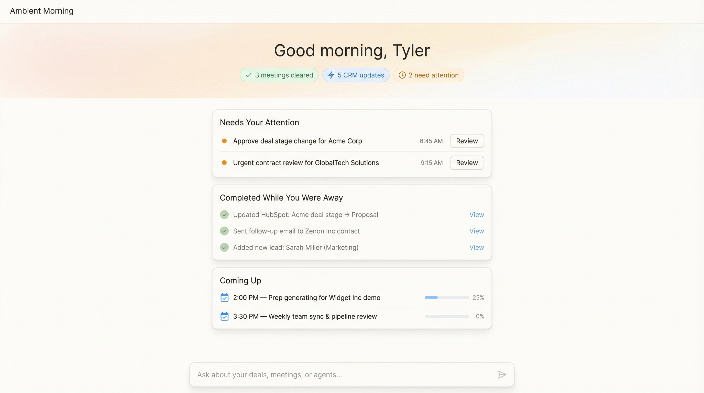

# Visual Directions: Agent Command Center

**Initiative:** Agent Command Center
**Date:** 2026-02-16
**Owner:** Tyler
**Phase:** Build (design-brief-pending → visual directions generated)

---

## Design Brief Summary

The Agent Command Center is a **chat-centric experience** where users configure agents, monitor activity, consume polished artifacts, and manage deals from a single surface. The visual language must communicate:

1. **Action-first, not insight-first** — The interface tells you what happened and what to do, not what to explore
2. **Trust through evidence** — Every AI action is transparent, source-attributed, and reversible
3. **Speed and confidence** — Reps should feel like they're clearing work, not browsing dashboards
4. **Proactive, not reactive** — The system comes to you with value delivered, not waiting for questions

**Key constraint:** Must feel distinctly different from Gong's insight-heavy dashboard and Salesforce's CRM-copilot pattern. The validated direction (v10, 88% would-use) centers on "show me what you did, what I need to decide, and what's coming."

---

## Competitive Context

The visual directions are informed by the comprehensive [competitive landscape](./competitive-landscape.md) analysis of 13 competitors:

- **Gong** uses snapshot widgets + Account AI — dense, insight-heavy, leader-oriented
- **Clari** uses Groove Daily Digest + Omnibar sidebar — email-first, CRM-embedded
- **Fathom/Fireflies** rely on keyword alerts and query interfaces — reactive, not proactive
- **Salesforce/HubSpot** embed copilot chat into existing CRM — passive "How can I help?"

**No competitor** offers:

- Time-aware dynamic homepage (8AM ≠ 5PM)
- Rapid-fire meeting batch clearing
- Evidence-backed CRM updates with source quotes
- Value-attribution visibility ("here's what I did for you")

These gaps define our visual differentiation space.

---

## Key Screens

### Screen 1: Daily Hub / Action Morning

The most important screen — the first thing reps see. Defines the entire product's visual identity.

---

#### Direction A: "Ambient Morning"

- **Philosophy:** Calm, minimal, and warm. Surfaces only what matters with maximum breathing room. The screen feels like a personal morning briefing, not a dashboard.
- **Rationale:** Rejects Gong's density and Clari's multi-widget approach. Aligns with Rob's "tell me what you've done, what needs approval, and what's scheduled" — nothing more. Optimized for the 8AM use case where reps want clarity, not complexity.
- **Trade-offs:** May feel too sparse for data-hungry leaders. Less information density than competitors. Relies on chat for exploration.
- **Best for:** Sales reps who want to clear and go. First-time users who shouldn't feel overwhelmed.

---

#### Direction B: "Command Dashboard" _(Recommended)_

- **Philosophy:** Structured, professional, and data-rich without being dense. Three clear columns organize the day: Action Queue, Activity Feed, Schedule. Value attribution banner makes AI contribution immediately visible.
- **Rationale:** Balances the action-first principle with enough data context for leaders and power users. The indigo value banner ("3 meetings cleared • 5 CRM updates • $127K pipeline influenced • 2.5 hrs saved") is the key differentiator — no competitor shows value delivered. Surpasses Gong's snapshot widgets by leading with action, not charts. Pipeline mini-widget in Schedule column gives deal context without a separate page.
- **Trade-offs:** Three columns may not translate perfectly to mobile. More implementation complexity than Direction A. Needs responsive breakpoints.
- **Best for:** Most users (reps, leaders, admins). The daily anchor experience. Scales from simple (3 items) to complex (20+ items) without layout change.

---

#### Direction C: "Living Timeline"

- **Philosophy:** Chronological, narrative, and engaging. The day unfolds as a timeline with a progress ring driving toward "all meetings cleared." Feels alive — like a personal feed, not a static dashboard.
- **Rationale:** Leapfrogs competitors by making the daily experience feel dynamic and gamified. The progress ring ("3/8 meetings processed — tap to continue clearing") creates a completion drive. Value metrics (hours saved, pipeline updated, AI accuracy) positioned prominently. Evidence quotes inline with approvals.
- **Trade-offs:** Highest implementation complexity. Timeline layout may not scale well for users with 20+ items. Progress ring gamification could feel gimmicky if not executed well.
- **Best for:** Power users who process many meetings daily. Users who respond to completion/progress indicators.

---

### Screen 2: Meeting Clearing

The killer feature validated at 88% (v10). Rob: "boom boom boom. Eight meetings done. Fifteen minutes."

---

#### Direction A: "Card Carousel" _(Recommended)_

- **Philosophy:** Focused, decisive, fast. One meeting at a time dominates the screen. Everything drives toward the "Approve All" action. Bottom carousel shows progress and lets you jump.
- **Rationale:** Directly implements Rob's "each meeting is like its own card" vision. The single-focus layout minimizes cognitive load — you're making one decision at a time. Source quote inline builds trust. Estimated time remaining ("~4 min") sets expectations. No competitor has anything like this.
- **Trade-offs:** Can't see all meetings at once (use Direction B if overview needed). Requires animated transitions between cards.
- **Best for:** Reps with 5-10 meetings/day. The primary clearing experience.

---

#### Direction B: "Stack Clear"

- **Philosophy:** Efficient, inbox-like. All meetings visible at once with inline expansion. Feels like clearing an email inbox — methodical and satisfying.
- **Rationale:** Better overview of what's ahead. "Approve All Remaining" button for high-trust users who want to batch everything at once. Compact format shows more context (cleared meetings stay visible with green checks).
- **Trade-offs:** Less focused than carousel — user sees waiting items which may cause context-switching anxiety. Expanded card area is smaller than full-page carousel card.
- **Best for:** Admins or leaders who process many meetings and want full visibility. Users who prefer list views over carousel views.

---

### Screen 3: Meeting Artifact Delivery

How users consume the output of their agents — the polished recap, prep, and coaching artifacts.

---

#### Direction A: "Evidence Canvas" _(Recommended)_

- **Philosophy:** Trust through transparency. Every claim in the recap links to a source quote. The evidence panel is the primary differentiator — it turns AI output from "trust me" to "here's the proof."
- **Rationale:** Directly addresses the trust problem ("I don't trust AskElephant with my information"). No competitor (Gong, Fathom, Fireflies) prominently shows source quotes alongside AI-generated summaries. The 94% confidence indicator, privacy badge, and linked evidence quotes create a layered trust system. Deal Intelligence extraction (Budget, Timeline, Decision Maker, Competitors) is displayed in a structured card for quick scanning.
- **Trade-offs:** Two-panel layout requires wider screens. Evidence panel may feel redundant for high-trust users. Needs thoughtful responsive design (evidence could collapse to expandable sections on narrow screens).
- **Best for:** All users, especially during the trust-building phase of adoption. Critical for admin/RevOps users who need to verify AI accuracy.

---

### Screen 4: Chat-Based Agent Configuration

The experience that replaces the 80-hour workflow builder with a 5-minute conversation.

---

#### Direction A: "Guided Conversation" _(Recommended)_

- **Philosophy:** Configuration through conversation with rich inline previews. Chat is the interface, but the embedded cards (agent config, before/after preview) provide the data density users need to trust.
- **Rationale:** Implements Sam's "settings are not toggles... it's a chat... AI first." The inline agent config card makes the conversation tangible — users can see exactly what the agent will do. The before/after preview on real data ("Preview: Acme Corp Discovery") is the trust-building moment. "Activate Agent" and "Adjust Rules" buttons keep the user in control.
- **Trade-offs:** Requires strong AI intent recognition. Chat history can get long — need clear separation between config conversations and casual questions. May need a side panel for complex multi-agent setups.
- **Best for:** All users, especially first-time agent configuration. The primary config flow.

---

## Recommendation

| Screen               | Recommended Direction      | Rationale                                                                                                                       |
| -------------------- | -------------------------- | ------------------------------------------------------------------------------------------------------------------------------- |
| **Daily Hub**        | **B: Command Dashboard**   | Best balance of action-first and data context. Value banner is the key differentiator. Scales across personas.                  |
| **Meeting Clearing** | **A: Card Carousel**       | Directly implements validated "boom boom boom" pattern. Maximum focus, minimum cognitive load.                                  |
| **Meeting Artifact** | **A: Evidence Canvas**     | Trust through transparency is our primary differentiator. No competitor does evidence linking at this level.                    |
| **Chat Config**      | **A: Guided Conversation** | Natural language config with inline previews implements "AI-first" vision. Before/after preview on real data builds confidence. |

**Overall visual language:** Clean, professional, blue/indigo accent system. Inter font. White backgrounds with subtle card shadows. Color used sparingly and semantically (green = done, amber = attention, blue = scheduled/info). Dense enough for professionals, breathing enough for clarity. Trust signals (confidence badges, source quotes, privacy indicators) integrated naturally, not bolted on.

---

## Design Vocabulary Established

These terms carry directly into Storybook implementation:

| Term                       | Component                 | Description                                                                                                       |
| -------------------------- | ------------------------- | ----------------------------------------------------------------------------------------------------------------- |
| **Value Banner**           | `ValueAttributionBanner`  | Full-width indigo banner showing AI contribution (meetings cleared, CRM updates, time saved, pipeline influenced) |
| **Action Queue**           | `ActionQueue`             | Priority-sorted cards requiring user decision (approvals, reviews)                                                |
| **Activity Feed**          | `ActivityFeed`            | Filterable stream of completed agent actions with timestamps                                                      |
| **Clearing Card**          | `MeetingClearingCard`     | Full-width card with AI summary + proposed CRM updates + approve/edit/skip                                        |
| **Clearing Carousel**      | `MeetingClearingCarousel` | Horizontal card progression with progress bar and thumbnail queue                                                 |
| **Evidence Panel**         | `EvidencePanel`           | Right-side panel linking recap claims to source quotes with timestamps                                            |
| **Deal Intelligence Card** | `DealIntelligenceCard`    | Compact structured data card (Budget, Timeline, Decision Maker, Stage, Competitors)                               |
| **Confidence Badge**       | `ConfidenceBadge`         | Small indicator showing AI confidence percentage (green ≥90%, amber 70-89%, red <70%)                             |
| **Privacy Badge**          | `PrivacyBadge`            | Pill-shaped indicator showing privacy status (Internal Only, External OK, Pending)                                |
| **Agent Config Card**      | `AgentConfigCard`         | Inline chat card showing proposed agent setup (trigger, actions, auto-run threshold)                              |
| **Preview Card**           | `CrmPreviewCard`          | Before/after comparison of CRM field changes with "Activate" action                                               |
| **Source Quote**           | `SourceQuote`             | Expandable quote block with speaker name, timestamp, and link to transcript moment                                |

---

## Chosen Direction

**Status:** Pending stakeholder review

_To be updated after Tyler reviews directions and confirms or requests modifications._

| Field                   | Value |
| ----------------------- | ----- |
| Direction chosen        | TBD   |
| Modifications requested | TBD   |
| Date validated          | TBD   |
| Validated by            | TBD   |

---

## Next Steps

1. **Tyler reviews** these directions and picks/modifies
2. **Update this doc** with chosen direction
3. **Run `/proto agent-command-center`** — prototype builder implements the chosen visual language in Storybook
4. **Run `/validate agent-command-center`** — jury evaluation on the visual direction before build commitment

---

_Generated from competitive landscape analysis of 13 competitors, v10 validated patterns (88% would-use rate), and CEO feedback ("I would pay lots of money for that right now")._
