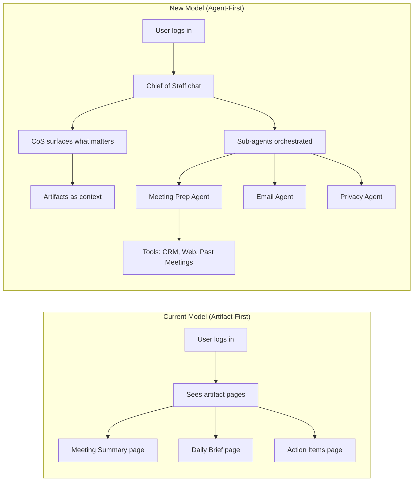

# Agent-First Vision: The Paradigm Shift

**Date:** 2026-02-23
**Initiative:** Chief of Staff Experience

## The Shift

We are making a fundamental reframing of how AskElephant works. The primary interaction model is shifting from an artifact-first approach to an agent-first approach.

**FROM:** Five artifact entry points (Meeting Summary, Prep, Daily Brief, Weekly Brief, Action Items) as primary interaction.
**TO:** Chief of Staff agent as primary chat-based interaction that orchestrates sub-agents, surfaces what matters at the right time, and produces artifacts as contextual outputs (not destinations).

## Historical Arc

As discussed by leadership, the history of meeting capture has followed this trajectory:
`Paper -> Audio recorder -> Video recording -> Transcript -> Summary -> Agent (Chief of Staff)`

Just as the summary made the transcript a background artifact, the Chief of Staff agent makes the summary a background artifact. Summaries become contextual data that feeds the agent, not the primary thing you interact with directly.

## Key Concepts

1. **Chief of Staff = Primary Agent**: The overarching agent that learns about you and surfaces important information proactively.
2. **Sub-Agent Architecture**: Separate, specialized agents (e.g., Meeting Prep agent, Email agent, Privacy agent) that are orchestrated by the CoS.
3. **Tool Model**: Agents have access to toolkits (web search, CRM search, past meetings), moving away from rigid workflows. "Here are your tools; you know how I like to be prepped."
4. **Teaching > Configuration**: Users teach their CoS through conversation rather than buried settings pages. (e.g., CoS asks: "I noticed you do X. Want me to add that to my memory?")
5. **Personal Operating System**: Long-term, the CoS becomes a personal OS that stores preferences, working style, and context.
6. **Extensibility Model**: We nail one agent experience first, then plug in more agents for the CoS to orchestrate. New capabilities are delivered contextually.
7. **Meeting Summary Repositioned**: The meeting summary still exists as a critical artifact, but users don't interact with it directly as the final destination. The CoS surfaces action items, sharing needs, and context *from* it.
8. **Relay.app Reference**: We look to Relay.app as a UX reference for agent configuration patterns, including agent team management, agent creation wizards, tool/app selection per agent, and skill/prompt template suggestions.

## Practical Implications (Near-Term)

The current sprint (Feb 24-28) for Meeting Summary remains relevant because the CoS needs high-quality artifacts to surface. However, the framing shifts:
* **Do not gold-plate the meeting summary page itself.**
* **The investment goes into making it a great artifact that the CoS can work with.**
* The "Chief of Staff chat prompt on Home that launches summary artifact" goal aligns perfectly with this vision.

## Open Design Questions

* **First Login Flow:** How does the user first encounter and interact with the CoS?
* **Agent Teaching UX:** How does the interface gracefully handle teaching the CoS?
* **Artifact Surfacing Model:** How are artifacts (like the Meeting Summary) presented contextually within the CoS chat without overwhelming the user?