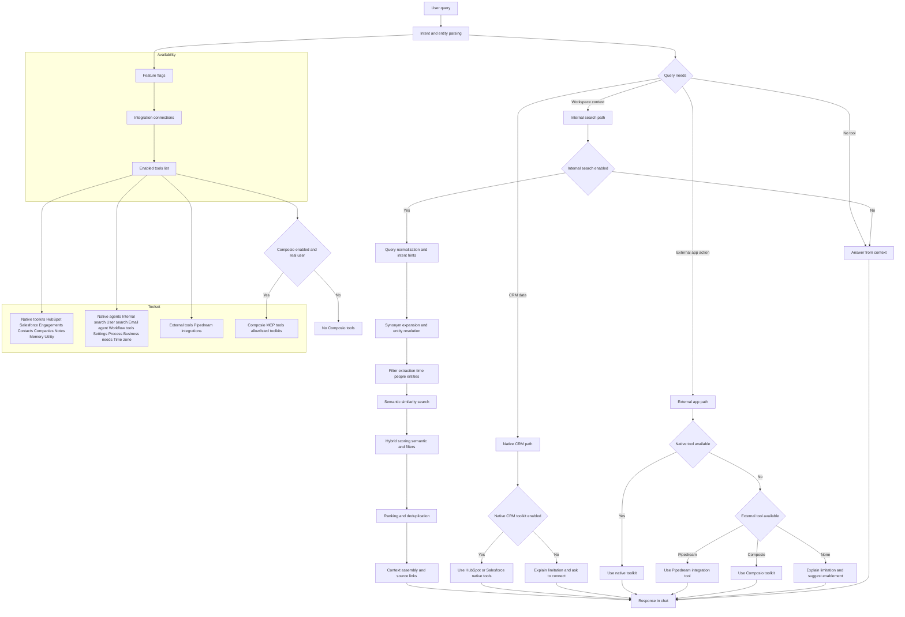

# Internal Search: Full Tooling Flow

```mermaid
flowchart TD
  A[User query] --> B[Intent and entity parsing]

  subgraph Availability
    V1[Feature flags] --> V2[Integration connections]
    V2 --> V3[Enabled tools list]
  end

  B --> V1

  subgraph Toolset
    T1[Native toolkits HubSpot Salesforce Engagements Contacts Companies Notes Memory Utility]
    T2[Native agents Internal search User search Email agent Workflow tools Settings Process Business needs Time zone]
    T3[External tools Pipedream integrations]
    T4[Composio MCP tools allowlisted toolkits]
  end

  V3 --> T1
  V3 --> T2
  V3 --> T3
  V3 --> C1{Composio enabled and real user}
  C1 -->|Yes| T4
  C1 -->|No| T5[No Composio tools]

  B --> D0{Query needs}
  D0 -->|Workspace context| D1[Internal search path]
  D0 -->|CRM data| D2[Native CRM path]
  D0 -->|External app action| D3[External app path]
  D0 -->|No tool| D4[Answer from context]

  D1 --> IS0{Internal search enabled}
  IS0 -->|No| D4
  IS0 -->|Yes| IS1[Query normalization and intent hints]
  IS1 --> IS2[Synonym expansion and entity resolution]
  IS2 --> IS3[Filter extraction time people entities]
  IS3 --> IS4[Semantic similarity search]
  IS4 --> IS5[Hybrid scoring semantic and filters]
  IS5 --> IS6[Ranking and deduplication]
  IS6 --> IS7[Context assembly and source links]
  IS7 --> R[Response in chat]

  D2 --> CRM0{Native CRM toolkit enabled}
  CRM0 -->|Yes| CRM1[Use HubSpot or Salesforce native tools]
  CRM0 -->|No| CRM2[Explain limitation and ask to connect]
  CRM1 --> R
  CRM2 --> R

  D3 --> EXT0{Native tool available}
  EXT0 -->|Yes| EXT1[Use native toolkit]
  EXT0 -->|No| EXT2{External tool available}
  EXT2 -->|Pipedream| EXT3[Use Pipedream integration tool]
  EXT2 -->|Composio| EXT4[Use Composio toolkit]
  EXT2 -->|None| EXT5[Explain limitation and suggest enablement]
  EXT1 --> R
  EXT3 --> R
  EXT4 --> R
  EXT5 --> R

  D4 --> R
```
