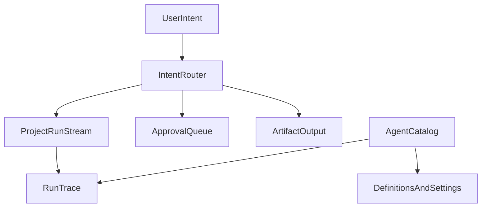

# Agent Experience Review

## Objective
Define how agents should be experienced inside Elmer so they feel like visible collaborators working on projects, rather than mostly a catalog of imported capabilities.

## Audience
Product, design, and engineering teams shaping the relationship between the `Agents` tab, project commands, the Elmer panel, HITL flows, and execution observability.

## Evidence Basis
- `orchestrator/src/app/(dashboard)/workspace/[id]/agents/page.tsx`
- `orchestrator/src/components/agents/AgentsList.tsx`
- `orchestrator/src/components/agents/AgentCard.tsx`
- `orchestrator/src/components/agents/AgentExecutionPanel.tsx`
- `orchestrator/src/components/commands/CommandExecutionPanel.tsx`
- `orchestrator/src/components/chat/ElmerPanel.tsx`
- `orchestrator/convex/agents.ts`
- `AGENT-BRIEF.md`
- [Agent Experience](https://agent-experience.dev/), especially [Multi-Agent Workspaces](https://agent-experience.dev/multi-agent-workspaces), [Routing & Intent Detection](https://agent-experience.dev/routing), [Human-in-the-Loop](https://agent-experience.dev/human-in-loop), and [Observability & Tracing](https://agent-experience.dev/observability)

## Current State
### What the current `Agents` experience optimizes for
The current `Agents` route is strong at:
- cataloging imported definitions
- showing provenance and source files
- enable/disable controls
- ad hoc execution
- agent-system inspection

That makes it effective as an admin or builder surface. It does not make it the right primary execution surface for a PM trying to move one project forward.

### Why it feels off
The product promise is outcome-first:
- write the PRD
- build the prototype
- validate the concept
- generate tickets

The current `Agents` UX is implementation-first:
- skill
- command
- subagent
- rule
- AGENTS.md

That mental model is backwards for most day-to-day usage.

## Best-Practice Principles
### 1. Multi-agent workspaces should center shared work, not just agent inventories
The strongest pattern from [Multi-Agent Workspaces](https://agent-experience.dev/multi-agent-workspaces) is a visible control room around shared projects, persistent identity, and active coordination.

### 2. Users should ask for outcomes, and routing should choose the right worker
The relevant pattern from [Routing & Intent Detection](https://agent-experience.dev/routing) is classifier-to-specialist dispatch. Users should not have to decide between a command, a skill, and a subagent just to advance a project.

### 3. HITL should be human-on-the-loop by default
From [Human-in-the-Loop](https://agent-experience.dev/human-in-loop), Elmer should favor autonomous progress with clear approval gates and exception handling rather than forcing users into frequent manual orchestration.

### 4. Logs are not enough
From [Observability & Tracing](https://agent-experience.dev/observability), users need more than success/failure and console-like output. They need:
- what the agent is doing
- what it used
- what it produced
- where it is blocked
- what decision needs human input

## Core Decision
### Decision
Split agent experience into two layers:
- a project-native work layer
- a secondary catalog/admin layer

### Rationale
This preserves the useful governance and provenance features of the current Agents page while putting agent work where users actually need it: inside projects and project-adjacent flows.

## Recommended Target Model
### 1. Agent Catalog
Keep a workspace-level catalog, but clearly position it as:
- definition browser
- provenance explorer
- enable/disable control
- testing and ops surface

This is for admins, builders, and debugging. It should not be the default answer to "how do I get work done?"

### 2. Project Agent Layer
Every project should have a visible "active work" surface showing:
- current runs
- assigned agent roles
- recent outputs
- blockers
- pending approvals
- next best actions

This should be the primary place where users experience agents.

### 3. Intent Routing
Users should start from goals such as:
- analyze this transcript
- generate the PRD
- build the prototype
- validate with personas
- turn this into tickets

The system should route those intents to the correct agent or sequence of agents.

### 4. HITL and Approvals
Approvals should be attached to project outcomes and decisions:
- promote signal to project change
- accept validation result
- approve prototype iteration
- confirm roadmap or ticket generation

HITL should feel like part of project progression, not like an out-of-band interruption.

### 5. Observability
Provide two levels of observability:
- project-level run stream for day-to-day work
- workspace-level agent hub for cross-project monitoring

Each run should clearly show:
- status
- current step
- last tool action
- artifact output
- human gate
- cost or token estimate when useful

## Recommended Surface Model

## Proposed Responsibilities
### Project page
- primary execution entry point
- next action suggestions
- active run stream
- approvals
- artifact handoff

### Elmer panel
- conversational entry point
- flexible intent capture
- quick status on active jobs
- inline HITL responses
- lightweight navigation into project context

### Agent hub
- workspace-wide operations view
- filtering by running, waiting, failed, completed
- escalation monitoring
- quick jump into project or trace

### Agent catalog
- builder/admin view
- definition provenance
- controls and auditability

## Risks And Mitigations
### Risk
Removing prominence from the current Agents tab could frustrate technical users.

Mitigation:
Preserve the catalog, but relabel and reposition it as a secondary layer.

### Risk
Project pages could become overloaded by too much run-state detail.

Mitigation:
Use a compact active-work summary with drill-down traces instead of dumping full logs into the project page.

### Risk
Intent routing may hide what is actually being executed.

Mitigation:
Always show which agent or sequence was selected, why, and how to override when needed.

## Recommendation Summary
1. Do not make users think in terms of skills, rules, and subagents to do normal work.
2. Make project-native agent activity the default experience.
3. Keep a secondary catalog for provenance and operations.
4. Treat approvals as project decisions, not generic interruptions.
5. Turn observability into structured traces and active work views, not only logs.

## Concrete Next Actions
1. Reposition the current `Agents` page as a catalog/admin surface.
2. Add a project-level active agents and approvals section to the project cockpit.
3. Consolidate execution entry around outcome-based commands and intent routing.
4. Define the `Agent Hub` as the cross-project monitoring layer, not the main work entry point.
5. Standardize run traces so users can inspect plan, steps, tools, outputs, and human gates from one place.
