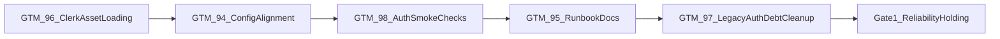

# Elmer Lane 0 Kickoff — 2026-03-06

**As of:** 2026-03-06  
**Lane:** `Lane 0 — Platform Reliability`  
**Primary issues:** `GTM-94`, `GTM-95`, `GTM-96`, `GTM-97`, `GTM-98`  
**Primary tracker:** [Elmer Linear project](https://linear.app/askelephant/project/elmer-e42608f6079d/issues?layout=list&ordering=priority&grouping=workflowState&subGrouping=none&showCompletedIssues=all&showSubIssues=true&showTriageIssues=true)

## Objective
Open Elmer execution by making auth and deployment trustworthy enough that the rest of the roadmap can be validated against a stable runtime.

## Why This Lane Starts First
The current roadmap gates everything else on reliability. If `/login`, Clerk asset loading, issuer alignment, and auth smoke checks are not trustworthy, the testing lane, migration lane, and team-safe lane all operate on unstable ground.

## Entry Gate
None. This is the active first lane.

## Exit Gate
`Lane 0` is holding when all of the following are true:

- `/login` loads reliably
- Clerk frontend host, app origin, and Convex issuer configuration agree
- the auth/domain smoke check is trustworthy
- the deployment/auth runbook reflects the real stack
- legacy auth debt is reduced only after the live path is stable

## Ordered Execution Slices

### Slice 0.1 — Restore Clerk asset loading
**Primary issue:** `GTM-96`  
**Owner pattern:** auth + deployment  
**Goal:** restore public resolution and asset loading for `clerk.elmer.studio` and `accounts.elmer.studio`

Why first:
- if the assets do not resolve, `/login` cannot be trusted
- all later config work becomes harder to validate

Required evidence:
- browser-confirmed login asset loading
- DNS/reachability confirmation
- clear note on whether the issue was DNS, config, or both

### Slice 0.2 — Align Clerk, Convex, and app origin configuration
**Primary issue:** `GTM-94`  
**Owner pattern:** auth + platform  
**Goal:** make frontend, backend, and auth issuer assumptions agree

Why second:
- once assets load, config mismatches become the next most likely source of auth breakage
- this slice clarifies the real authority for JWT validation and app origin

Required evidence:
- confirmed issuer/frontend host agreement
- successful authenticated route load
- explicit env alignment notes

### Slice 0.3 — Make auth smoke checks trustworthy
**Primary issue:** `GTM-98`  
**Owner pattern:** platform + test-infra  
**Goal:** distinguish app uptime from auth health with one actionable check

Why third:
- after the live auth path works, the team needs a release-gating check that detects breakage early
- this becomes the foundation for knowing when `Gate 1` is really holding

Required evidence:
- one reproducible smoke command
- failure mode examples with actionable output
- confirmation that auth regressions can be distinguished from generic site outages

### Slice 0.4 — Finalize deployment/auth runbook
**Primary issue:** `GTM-95`  
**Owner pattern:** deployment + docs  
**Goal:** make the real current stack and custom-domain requirements unambiguous

Why fourth:
- docs should follow the proven live path
- this slice should capture the working state established by the first three slices

Required evidence:
- updated runbook sections
- explicit custom-domain DNS requirements
- env var guidance consistent with the validated runtime

### Slice 0.5 — Remove stale legacy auth debt
**Primary issue:** `GTM-97`  
**Owner pattern:** auth + refactor  
**Goal:** reduce mixed-model confusion only after the Clerk-native path is stable

Why last:
- this is cleanup and clarity work, not the first live blocker
- removing or refactoring auth debt too early can make a still-fragile live path harder to debug

Required evidence:
- inventory of stale paths removed or isolated
- confirmation that no live auth flow was broken by cleanup
- clear statement of what remains intentionally compatible versus removed

## Parallelism Rule
Do not parallelize the main implementation slices inside Lane 0 until Slice 0.1 and Slice 0.2 have produced a trustworthy live auth path. After that:

- Slice 0.3 and Slice 0.4 can overlap slightly
- Slice 0.5 stays last

## Suggested Swarm Assignments

| Slice | Issue | Owner pattern | Handoff target |
| --- | --- | --- | --- |
| Slice 0.1 | `GTM-96` | auth + deployment | Slice 0.2 |
| Slice 0.2 | `GTM-94` | auth + platform | Slice 0.3 |
| Slice 0.3 | `GTM-98` | platform + test-infra | Slice 0.4 |
| Slice 0.4 | `GTM-95` | deployment + docs | Slice 0.5 |
| Slice 0.5 | `GTM-97` | auth + refactor | `Gate 1` review |

## Required Linear Updates

For every slice that lands meaningful progress:

1. update the issue comment or state in Linear first
2. note the evidence produced
3. note the next handoff target

At minimum:
- `GTM-96` should record the live asset-loading resolution evidence
- `GTM-94` should record the issuer/app-origin alignment evidence
- `GTM-98` should record the smoke-check command and expected pass/fail behavior
- `GTM-95` should record the runbook/doc sync checkpoint
- `GTM-97` should record what legacy auth paths were removed or isolated

## Required Doc Updates

- `DEPLOYMENT.md` when runtime or runbook behavior changes
- `AGENT-BRIEF.md` only if the lane meaning or gating story changes materially
- `pm-workspace-docs/roadmap/elmer-sequenced-execution-checklist.md` only if milestone order or acceptance criteria change
- `pm-workspace-docs/status/swarm/elmer-swarm-dashboard.md` when the active slice or gate status changes

## Lane 0 Review Trigger

Run a gate review after Slice 0.4 and again after Slice 0.5.

Review questions:

1. Does `/login` reliably work in browser validation?
2. Can the auth smoke check distinguish auth failure from generic uptime?
3. Are the docs now describing the validated runtime instead of an aspirational or mixed model?
4. Is enough auth debt removed that the team can operate without ambiguity?

If all answers are yes, `Gate 1` can be treated as holding and `Lane A`, `Lane B`, and `Lane C` can begin full parallel execution.
