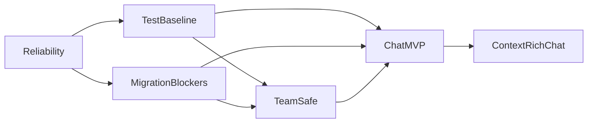

# Elmer Swarm Dashboard

**As of:** 2026-03-06  
**Primary tracker:** [Elmer Linear project](https://linear.app/askelephant/project/elmer-e42608f6079d/issues?layout=list&ordering=priority&grouping=workflowState&subGrouping=none&showCompletedIssues=all&showSubIssues=true&showTriageIssues=true)  
**Purpose:** Give a one-page view of lane status, gates, blockers, and next actions without replacing Linear.

## Project Snapshot

- Project status: `In Progress`
- Health: `onTrack`
- Priority: `Urgent`
- Progress: about `41.9%`
- Scope: `71`

## Critical Path

## Gate Status

| Gate | Status | Meaning |
| --- | --- | --- |
| `Gate 1` Reliability holding | `Not holding yet` | Auth/deployment still leads the roadmap |
| `Gate 2` Test baseline holding | `Not holding yet` | Smoke progress exists, but deterministic release-gating coverage is incomplete |
| `Gate 3` Migration holding | `Not holding yet` | Migration is explicit and underway, but named blockers are still open |
| `Gate 4` Team-safe holding | `Partially landed` | Blame-chain and presence progress exists, but milestone exit criteria are not complete |

## Lane Status

| Lane | Current status | Active issue set | Current blocker | Next action | Evidence |
| --- | --- | --- | --- | --- | --- |
| `Lane 0 — Platform Reliability` | `Active` | `GTM-94`, `GTM-95`, `GTM-96`, `GTM-97`, `GTM-98` | GTM-96 remains the active slice because browser validation still does not show a working Clerk sign-in experience on public `/login` | Keep GTM-96 active and debug the browser-visible route/render/auth-flow failure before handing off to `GTM-94` | Local `check:auth` passes and public `/login` returns `200`, but browser validation lands on the Elmer shell instead of a visible sign-in form; see `swarm/gtm-96-swarm-2026-03-06.md` |
| `Lane A — Testing Completion` | `Prepared / parallel-ready after Gate 1` | `GTM-78`, `GTM-79`, `GTM-80`, `GTM-81`, `GTM-82`, `GTM-83`, `GTM-84`, `GTM-87`, `GTM-88`, `GTM-91` | Reliability gate is not yet holding; release-gating baseline is broader than smoke | Continue POM, seeded E2E, and CI preparation so the lane can accelerate once reliability is stable enough | Smoke was reported green; `GTM-78`, `GTM-82`, and `GTM-83` are already in progress |
| `Lane B — Team-Safe Operation` | `Prepared / parallel-ready after Gate 1` | `GTM-55`, `GTM-58`, `GTM-69`, `GTM-70` | Milestone is downstream of reliability and still needs broader operational trust coverage | Continue orchestrator, onboarding, attribution, and presence work once broader execution opens | Minimal blame-chain and presence landed; latest checkpoint adds project active-work trace entry points and persistent project/job thread reuse on existing Convex surfaces, but milestone is not complete |
| `Lane C — Migration Blockers` | `Prepared / parallel-ready after Gate 1` | `GTM-59`, `GTM-99`, `GTM-100`, `GTM-101`, `GTM-102`, `GTM-103` | Named blockers are explicit but unresolved; first tranche not yet declared fully stable | Keep tranche 1 stable and burn down the blocker set in issue order | Tranches 1-6 and multiple parity checkpoints are documented, but blockers remain open |
| `Lane D — Chat Readiness / Chat MVP` | `Gated` | `GTM-71` to `GTM-77` | Gates 1-3 are not holding, so Chat should not become the active implementation lane | Keep to planning/contracts only until the roadmap gates open | Reset docs and issue comments explicitly keep this gated; recent safe work only hardened existing project/job thread persistence and inspectability without opening broader Chat MVP scope |

## Lane Detail

### Lane 0 — Platform Reliability
- Owner pattern: platform / auth / deployment
- Why it matters: this is the first release gate for the whole swarm
- Current blocker: GTM-96 browser validation still does not show a visible Clerk sign-in form, so the lane cannot cleanly hand off to GTM-94 yet
- Active slice order:
  1. `GTM-96` restore Clerk asset loading
  2. `GTM-94` align Clerk/Convex/app-origin configuration
  3. `GTM-98` make auth smoke checks trustworthy
  4. `GTM-95` finalize deployment/auth runbook
  5. `GTM-97` remove stale legacy auth debt
- Immediate next action:
  1. debug the browser-visible `/login` route/render/auth-flow behavior
  2. confirm why the page settles on the Elmer shell instead of a visible sign-in form
  3. keep `GTM-96` active until the Clerk UI is visibly correct

### Lane A — Testing Completion
- Owner pattern: test-infra and implementation agents
- Why it matters: smoke is not the same thing as a minimum credible release gate
- Current blocker: deterministic seeded E2E and CI-backed confidence are still incomplete
- Immediate next action:
  1. finish POM base coverage
  2. expand seeded inbox and agent execution tests
  3. add project/task and CI coverage

### Lane B — Team-Safe Operation
- Owner pattern: UI + Convex implementation
- Why it matters: Elmer cannot be treated as truly usable internally until collaboration is legible
- Current blocker: partial implementation exists, but the lane is not yet a full milestone pass
- Immediate next action:
  1. finish attribution chain
  2. expand presence surfaces
  3. finish orchestrator health/proposals
  4. finish internal team access/onboarding

### Lane C — Migration Blockers
- Owner pattern: architecture + implementation
- Why it matters: the migration is no longer vague, but the remaining tail still blocks clean completion
- Current blocker: `GTM-99` to `GTM-103` remain open and define the tail
- Immediate next action:
  1. keep tranche 1 stable
  2. resolve settings blockers
  3. resolve personas/knowledgebase and search decisions
  4. slice project detail parity work

### Lane D — Chat Readiness / Chat MVP
- Owner pattern: design / planning until gates open
- Why it matters: this becomes the visible operator surface only after stability exists underneath it
- Current blocker: Milestones 1 to 3 are not holding
- Immediate next action:
  1. continue contract/spec clarification only
  2. do not open implementation work early

## Issue Buckets

### Immediate execution bucket
- `GTM-94`
- `GTM-95`
- `GTM-96`
- `GTM-97`
- `GTM-98`

### Parallel-ready bucket after Gate 1
- `GTM-78`
- `GTM-79`
- `GTM-80`
- `GTM-81`
- `GTM-82`
- `GTM-83`
- `GTM-84`
- `GTM-87`
- `GTM-88`
- `GTM-91`
- `GTM-55`
- `GTM-58`
- `GTM-69`
- `GTM-70`
- `GTM-59`
- `GTM-99`
- `GTM-100`
- `GTM-101`
- `GTM-102`
- `GTM-103`

### Explicitly gated bucket
- `GTM-71`
- `GTM-72`
- `GTM-73`
- `GTM-74`
- `GTM-75`
- `GTM-76`
- `GTM-77`

## Update Rule

When this dashboard changes:

1. update Linear first if issue truth changed
2. then refresh this dashboard
3. then update any affected derived docs
