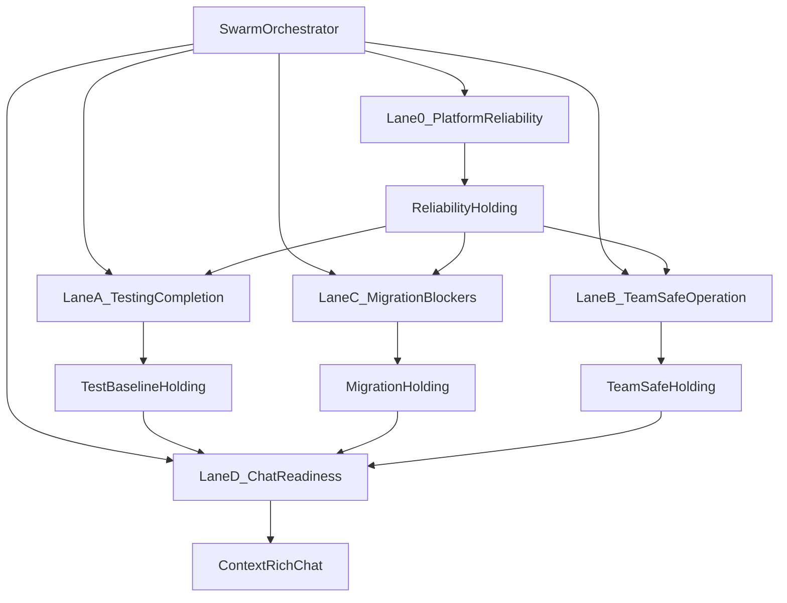

# Elmer Swarm Operating Contract

**Generated:** 2026-03-06  
**Audience:** Product, engineering, and agent operators coordinating Elmer execution  
**Purpose:** Define how Elmer should be executed through coordinated swarms without creating a second source of truth alongside Linear.

## Objective
Run Elmer through a gated multi-lane swarm that:

- executes work in the correct milestone order
- uses parallelism only where the roadmap allows it
- keeps Linear as the canonical execution tracker
- updates docs only when their explanatory contract changes
- prevents premature Chat work or stale-doc drift

## Ground Truth
This operating contract is derived from:

- `AGENT-BRIEF.md`
- `DEPLOYMENT.md`
- `orchestrator/MIGRATION-READINESS.md`
- `pm-workspace-docs/status/elmer-reset-and-recalibration.md`
- `pm-workspace-docs/status/elmer-source-of-truth-matrix.md`
- `pm-workspace-docs/roadmap/elmer-sequenced-execution-checklist.md`
- the live Linear project for Elmer

## Source Of Truth Rules

1. Linear is canonical for issue state, sequencing, milestones, blockers, and current progress.
2. Repo docs explain architecture, operations, gates, and rationale. They do not override Linear.
3. If docs and Linear disagree, trust Linear first, then update the derived docs afterward.
4. Do not treat local markdown as the live execution tracker.

## Swarm Model

## Lane Definitions

| Lane | Primary issues | Purpose | Current execution rule |
| --- | --- | --- | --- |
| `Lane 0` | `GTM-94` to `GTM-98` | Stabilize auth, deployment, env alignment, and release-gating reliability | Start first and treat as the first release gate |
| `Lane A` | `GTM-78`, `GTM-79`, `GTM-80`, `GTM-81`, `GTM-82`, `GTM-83`, `GTM-84`, `GTM-87`, `GTM-88`, `GTM-91` | Establish the minimum credible deterministic test baseline | Prepare immediately; execute fully once `Lane 0` is stable enough |
| `Lane B` | `GTM-55`, `GTM-58`, `GTM-69`, `GTM-70` | Make Elmer legible and safe for concurrent internal use | Can run in parallel with `Lane A` and `Lane C` once `Lane 0` is holding |
| `Lane C` | `GTM-59`, `GTM-99`, `GTM-100`, `GTM-101`, `GTM-102`, `GTM-103` | Burn down migration blockers and finish the Convex cutover tail | Can run in parallel with `Lane A` and `Lane B` once `Lane 0` is holding |
| `Lane D` | `GTM-71` to `GTM-77` | Deliver Chat / Agent Hub and then richer context-aware flows | Planning/spec work only until Milestones 1 to 3 are holding |

## Gate Rules

### Gate 1: Reliability Holding
Required before broader execution is treated as trustworthy.

Must be true:

- `/login` loads reliably
- auth/domain checks are trustworthy
- Clerk, Convex, and app-origin configuration agree
- deployment/auth docs match reality

### Gate 2: Test Baseline Holding
Required before safe rollout confidence exists.

Must be true:

- deterministic seeded E2E scenarios run reliably
- CI can run the minimum smoke suite
- the app has a real release gate beyond manual clicking

### Gate 3: Migration Holding
Required before Chat implementation opens.

Must be true:

- the first Convex tranche is stable on the high-traffic routes
- remaining blockers are either resolved or explicit intentional boundaries
- settings, search, and project detail have credible implementation paths

### Gate 4: Team-Safe Holding
Required before broader internal usage is treated as operationally safe.

Must be true:

- agent runs are attributable
- presence or equivalent location visibility works in core surfaces
- the orchestrator exposes usable project-health context

## Allowed Parallelism

### Phase 1
Run `Lane 0` alone.

### Phase 2
Once `Lane 0` is stable enough, run in parallel:

- `Lane A`
- `Lane B`
- `Lane C`

### Phase 3
Keep `Lane D` in planning/spec mode until:

- `Gate 1` is holding
- `Gate 2` is holding
- `Gate 3` is holding

### Phase 4
Open full Chat / Agent Hub execution only after the first three gates are holding.

## Daily Operating Rhythm

### 1. Daily kickoff
For each lane, record:

- owner
- active issue set
- entry gate status
- current blocker
- next action
- evidence link or explicit evidence gap

### 2. Midday checkpoint
For each lane, decide one of:

- continue current slice
- escalate blocker
- split issue into smaller execution slices
- pause because the gate is not actually holding

### 3. End-of-day reconciliation
For any lane with meaningful progress:

1. update Linear first
2. update only the affected docs
3. refresh the swarm dashboard

## Required Evidence

Every lane output must include:

- `as_of` timestamp
- evidence reference or explicit evidence gap
- owner
- next action

Do not let a lane claim progress without evidence.

## Linear Update Discipline

Always update Linear for:

- issue status changes
- milestone/sequence shifts
- meaningful checkpoints landed
- blocker discovery or blocker resolution
- explicit defer/cancel decisions

## Doc Update Discipline

Update docs only when their domain changes:

- `AGENT-BRIEF.md` when architecture or operating model changes
- `DEPLOYMENT.md` when auth/deployment/runbook behavior changes
- `orchestrator/MIGRATION-READINESS.md` when route classifications or migration blockers change
- `pm-workspace-docs/roadmap/roadmap-analysis.md` when the roadmap interpretation changes materially
- `pm-workspace-docs/roadmap/elmer-sequenced-execution-checklist.md` when gates, order, or acceptance criteria change
- swarm docs when lane ownership, gates, or execution rhythm changes

## Escalation Rules

Escalate immediately when:

- a lane claims progress without evidence
- a lane attempts to skip its entry gate
- Chat work becomes implementation work before Gates 1 to 3 are holding
- docs and Linear materially disagree on current execution truth
- a blocker belongs in a new Linear issue instead of being hidden in a broad umbrella issue

## Anti-Patterns

Do not:

- start Chat because it feels strategically exciting while reliability is still unstable
- report derived markdown as live execution truth
- hide unresolved work inside checkpoint comments without a named issue owner
- let migration-tail work drift into a vague “in progress” state without explicit next actions

## First Execution Slice

1. publish this contract
2. publish the swarm dashboard
3. publish the lane playbooks
4. reconcile lane status against Linear
5. begin `Lane 0` as the active execution lane
6. prepare `Lane A`, `Lane B`, and `Lane C` for immediate parallel start once `Gate 1` is holding

## Success Criteria

- one orchestrator model exists for all Elmer execution
- lane order matches the reset roadmap and Linear milestone order
- Linear is updated first for every meaningful checkpoint
- derived docs stay aligned without becoming competing trackers
- parallel work starts only where the roadmap explicitly allows it
- Chat work stays gated until reliability, testing, and migration are actually holding
