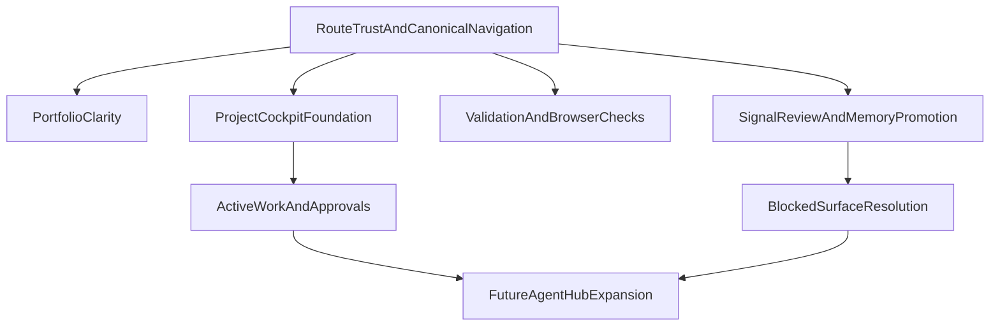

# UX Dependencies Map

## Objective
Make the dependencies between the UX lanes explicit so implementation can run in parallel where safe and sequence correctly where not.

## Audience
Anyone orchestrating concurrent agent or engineering work on the next Elmer UX phases.

## Evidence Basis
- `pm-workspace-docs/status/ux-sequenced-execution-plan.md`
- specialist swarm outputs synthesized from the planning swarm

## Dependency Summary

## Lane Dependencies
### Route Trust Lane
Feeds every other lane.

Produces:
- canonical routing contract
- stable route behavior
- regression coverage for navigation

### Portfolio Clarity Lane
Depends on:
- route trust

Feeds:
- project cockpit by clarifying handoff from workspace to project

### Project Cockpit Lane
Depends on:
- route trust
- portfolio clarity

Feeds:
- active work and approvals
- future project-native agent experience

### Agent Work Surface Lane
Depends on:
- route trust
- project cockpit foundation

Feeds:
- richer Elmer panel / Agent Hub integration
- project-native observability

### Signals And Memory Lane
Depends on:
- route trust
- blocked-surface policy decisions for personas/knowledgebase

Feeds:
- later memory-first navigation
- future graph-backed context surfaces

### Validation Lane
Depends on:
- none first; it is foundational

Feeds:
- all phases by defining pass/fail conditions

## What Can Run In Parallel
### Safe to run in parallel immediately
- route audit
- smoke/deep-link testing expansion
- browser validation checklist prep
- cockpit IA spec work

### Safe to run in parallel after route trust is stable
- workspace portfolio copy/handoff improvements
- overview-default project cockpit work
- active work surface design/spec

### Should not run fully in parallel yet
- deep persona/knowledgebase redesign
- broad graph UI work
- major Elmer panel / Agent Hub expansion beyond project-aware usage

## Decision
Use route trust as the root dependency, then split into cockpit and memory branches, with active work built on top of the cockpit branch.

## Rationale
This sequencing preserves user trust while still allowing meaningful parallelization across IA, validation, and agent-experience work.

## Concrete Next Actions
1. Treat the dependency graph as the coordination reference for new execution swarms.
2. Do not assign agent-work-surface implementation ahead of cockpit foundation work.
3. Do not assign blocked-surface redesign work until policy is explicit.
