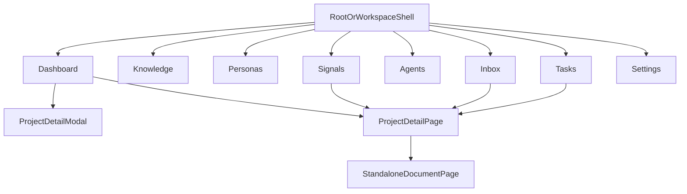
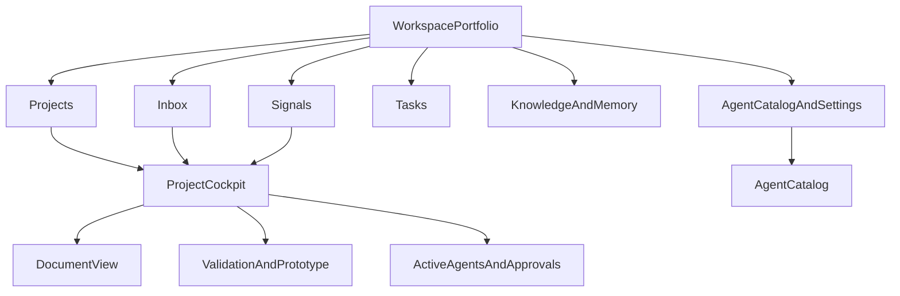

# Elmer UX Flow Map

## Objective
Map the current Elmer navigation and task flow against a proposed project-first model that better supports discovery compression, validation, and agent collaboration.

## Audience
Design and engineering teams aligning on navigation, page responsibilities, and the relationship between workspace-level and project-level surfaces.

## Evidence Basis
- `orchestrator/src/components/chrome/Navbar.tsx`
- `orchestrator/src/app/(dashboard)/workspace/[id]/WorkspacePageClient.tsx`
- `orchestrator/src/components/kanban/*.tsx`
- `orchestrator/src/app/(dashboard)/projects/[id]/ProjectDetailPage.tsx`
- `orchestrator/src/app/(dashboard)/projects/[id]/documents/[docId]/StandaloneDocumentPage.tsx`
- `orchestrator/src/components/commands/CommandExecutionPanel.tsx`
- `orchestrator/src/components/agents/AgentsList.tsx`

## Current Navigation Model
The current product behaves like this:

### What this means in practice
- The app teaches workspace utility categories first.
- The project page is where meaningful work actually happens.
- Several surfaces push users into projects, but `Projects` itself is not modeled as a first-class destination.
- The same project can be entered through multiple surfaces with different context and different detail depth.

## Current Task Flows
### Flow 1: Create and start a project
1. User lands on workspace dashboard.
2. User creates a project from the board or a signal cluster.
3. User often returns to the board, not directly into a project cockpit.
4. User later opens the project page for real work.

### Flow 2: Work inside a project
1. User opens `/projects/[id]`.
2. User navigates between ten tabs.
3. User may open a standalone document page.
4. User often loses tab or project context on return.

### Flow 3: Run automation
1. User can execute from the project `Commands` tab.
2. User can also execute from the `Agents` catalog with optional context.
3. User can also use the Elmer panel.
4. Logs and HITL handling live in still another experience layer.

## Current Flow Problems
### Navigation mismatch
The top-level nav does not reflect the actual work hierarchy.

### Context mismatch
Project routes, document routes, and workspace routes do not form one consistent scope model.

### Action mismatch
Users can ask for the same outcome from multiple places with different framing:
- run a command
- execute an agent
- use chat
- act from inbox

## Proposed Navigation Model
Use `Workspace` as the portfolio lens and `Project` as the primary work lens.

## Proposed Page Responsibilities
### Workspace level
Use for portfolio and cross-project operation:
- Kanban and portfolio prioritization
- raw intake triage
- cross-project signals and orphan evidence
- cross-project tasks
- team-level observability
- agent catalog and settings

### Project level
Use as the main work cockpit:
- project summary and TL;DR
- next best action
- evidence quality and linked signals
- current stage and readiness
- key artifacts
- active agents and approvals
- prototype and validation status
- tickets and execution outputs

### Document level
Use for focused artifact work only:
- edit or review a single artifact
- preserve strong project context
- show linked signals, tasks, and approvals
- always support a clean return to the project state the user came from

## Proposed Project Cockpit Structure
Replace the overbroad tab sprawl with a more outcome-oriented grouping:

- `Overview`
  - stage status
  - next action
  - active agents
  - blockers
- `Evidence`
  - linked signals
  - personas
  - source inputs
  - open questions
- `Artifacts`
  - research
  - PRD
  - design brief
  - engineering spec
  - GTM brief
  - prototype
- `Execution`
  - commands
  - jobs
  - tickets
  - approvals
- `History`
  - timeline
  - decisions
  - major transitions

## Specific IA Changes
### Keep
- Workspace board as the main portfolio overview
- Standalone document view for deep work
- Signals and inbox as distinct entry points for raw and structured evidence

### Refine
- Add a first-class `Projects` destination and consistent project routing under workspace scope
- Reframe the dashboard as "portfolio view" instead of the implicit default home for all work
- Make project creation end inside the project cockpit
- Preserve context when moving from project to document and back

### Merge
- Merge the project modal into a lighter preview pattern or remove it
- Merge duplicate execution entry points conceptually around project outcomes
- Merge scattered attention surfaces into a clearer queue for active work and approvals

### Remove
- Remove reliance on legacy redirect routes as meaningful navigation
- Remove hidden deep-link patterns that do not actually preserve state

## Decision And Rationale
### Decision
Adopt a two-level model:
- workspace for portfolio control
- project for execution control

### Rationale
This is the clearest way to align navigation, mental model, and product outcome chain. It lets the workspace stay lightweight and strategic while making project execution more guided and less fragmented.

## Risks And Mitigations
### Risk
Users who rely on workspace-level utilities may feel the app became more nested.

Mitigation:
Keep cross-project entry points, but ensure they always hand off into a consistent project cockpit.

### Risk
Existing routes and tabs carry migration debt.

Mitigation:
Start with interaction and labeling changes before full route restructuring, then migrate URLs when the model is validated.

## Concrete Next Actions
1. Add a clear `Projects` navigation concept.
2. Define the canonical project cockpit layout and its primary default tab.
3. Decide whether `ProjectDetailModal` survives as preview or is removed.
4. Fix deep-link and return-path behavior for documents, tasks, and signals.
5. Reorganize project information around outcomes and progression instead of a growing list of disconnected tabs.
