# The Grand Apparatus

> A complete architectural map of Tyler Sahagun's PM Workspace for AskElephant — every agent, skill, command, data flow, and integration rendered visible.

---

## Part I: The Mermaid Diagram

```mermaid
---
title: "⚙️ THE GRAND APPARATUS — PM Workspace Architecture"
---
graph TB
    %% ═══════════════════════════════════════════
    %% TYLER — THE HUMAN AT THE CENTER
    %% ═══════════════════════════════════════════
    TYLER(("🧠 TYLER\nProduct Manager\nAskElephant"))

    %% ═══════════════════════════════════════════
    %% IDE LAYER — DUAL COPILOT SYSTEM
    %% ═══════════════════════════════════════════
    subgraph IDE_LAYER["🖥️ IDE LAYER — Dual Copilot System"]
        direction LR
        subgraph CURSOR_IDE["Cursor IDE"]
            CURSOR_AGENT["🤖 PM Copilot\n(Cursor Agent)"]
            SKYLAR["🎨 Skylar\nDesigner Copilot"]
        end
        subgraph CLAUDE_CODE["Claude Code"]
            CLAUDE_AGENT["🤖 PM Copilot\n(Claude Agent)"]
        end
    end
    TYLER -->|"natural language"| IDE_LAYER

    %% ═══════════════════════════════════════════
    %% COMMAND LAYER — 54 SLASH COMMANDS
    %% ═══════════════════════════════════════════
    subgraph COMMANDS["⌨️ COMMAND LAYER — 54 Slash Commands"]
        direction TB

        subgraph CMD_DAILY["🌅 Daily Operations"]
            CMD_MORNING["/morning"]
            CMD_EOD["/eod"]
            CMD_EOW["/eow"]
            CMD_TRIAGE["/triage"]
            CMD_GMAIL["/gmail"]
            CMD_SLACK_MON["/slack-monitor"]
            CMD_TEAM["/team"]
            CMD_BLOCK["/block"]
        end

        subgraph CMD_RESEARCH["🔬 Research & Strategy"]
            CMD_RESEARCH_X["/research"]
            CMD_LANDSCAPE["/landscape"]
            CMD_INGEST["/ingest"]
            CMD_SYNTHESIZE["/synthesize"]
            CMD_HYPOTHESIS["/hypothesis"]
            CMD_BRAINSTORM["/brainstorm-board"]
        end

        subgraph CMD_BUILD["🏗️ Build & Design"]
            CMD_PM["/pm"]
            CMD_PROTO["/proto"]
            CMD_LOFI["/lofi-proto"]
            CMD_CONTEXT_PROTO["/context-proto"]
            CMD_VALIDATE["/validate"]
            CMD_ITERATE["/iterate"]
            CMD_DESIGN["/design"]
            CMD_VISUAL_DESIGN["/visual-design"]
            CMD_FIGMA_SYNC["/figma-sync"]
            CMD_PLACEMENT["/placement"]
            CMD_PMM_VIDEO["/pmm-video"]
            CMD_FIGJAM["/figjam"]
        end

        subgraph CMD_SYNC["🔄 Sync & Status"]
            CMD_STATUS["/status"]
            CMD_STATUS_ALL["/status-all"]
            CMD_SYNC_DEV["/sync-dev"]
            CMD_SYNC_LINEAR["/sync-linear"]
            CMD_SYNC_GITHUB["/sync-github"]
            CMD_SYNC_NOTION["/sync-notion"]
            CMD_FULL_SYNC["/full-sync"]
            CMD_ROADMAP["/roadmap"]
            CMD_NOTION_ADMIN["/notion-admin"]
            CMD_POSTHOG["/posthog"]
        end

        subgraph CMD_OPS["⚡ Operations"]
            CMD_SAVE["/save"]
            CMD_UPDATE["/update"]
            CMD_SHARE["/share"]
            CMD_HELP["/help"]
            CMD_NEW_INIT["/new-initiative"]
            CMD_MERGE_INIT["/merge-initiative"]
            CMD_MAINTAIN["/maintain"]
            CMD_ADMIN["/admin"]
            CMD_SETUP["/setup"]
            CMD_AGENTS["/agents"]
            CMD_AVAIL["/availability-check"]
            CMD_ENGINEER["/engineer-profile"]
        end

        subgraph CMD_GROWTH["🌱 Growth & Thinking"]
            CMD_COLLAB["/collab"]
        end
    end

    IDE_LAYER --> COMMANDS

    %% ═══════════════════════════════════════════
    %% SUBAGENT LAYER — 20 SPECIALIZED AGENTS
    %% ═══════════════════════════════════════════
    subgraph SUBAGENTS["🤖 SUBAGENT LAYER — 20 Autonomous Agents"]
        direction TB

        subgraph SA_RESEARCH["Research Agents"]
            SA_RESEARCHER["📖 research-analyzer\n(fast)"]
            SA_SIGNALS["📡 signals-processor\n(fast)"]
        end

        subgraph SA_BUILD["Build Agents"]
            SA_PROTO["🔨 proto-builder\n(inherit)"]
            SA_CONTEXT_PROTO["📐 context-proto-builder\n(inherit)"]
            SA_ITERATOR["🔄 iterator\n(inherit)"]
            SA_VALIDATOR["✅ validator\n(inherit)"]
            SA_FIGMA["🎨 figma-sync\n(inherit)"]
            SA_REMOTION["🎬 remotion-video\n(inherit)"]
            SA_FIGJAM["📊 figjam-generator\n(fast)"]
        end

        subgraph SA_OPS["Operations Agents"]
            SA_SLACK["💬 slack-monitor\n(fast)"]
            SA_GMAIL["📧 gmail-monitor\n(fast)"]
            SA_NOTION["📓 notion-admin\n(fast)"]
            SA_POSTHOG["📈 posthog-analyst\n(inherit)"]
            SA_LINEAR["📋 linear-triage\n(fast)"]
            SA_HUBSPOT["💰 hubspot-activity\n(fast)"]
            SA_WORKSPACE["🔧 workspace-admin\n(fast)"]
        end

        subgraph SA_DOCS["Documentation Agents"]
            SA_DOCS_GEN["📝 docs-generator\n(inherit)"]
            SA_FEATURE_GUIDE["📘 feature-guide\n(inherit)"]
            SA_HYPOTHESIS["🧪 hypothesis-manager\n(fast)"]
            SA_CONTEXT_REV["👁️ context-reviewer\n(fast)"]
        end
    end

    COMMANDS --> SUBAGENTS

    %% ═══════════════════════════════════════════
    %% SKILLS LAYER — 33 KNOWLEDGE PACKAGES
    %% ═══════════════════════════════════════════
    subgraph SKILLS["🧠 SKILLS LAYER — 33 Knowledge Packages"]
        direction TB

        subgraph SK_ANALYSIS["Analysis Skills"]
            SK_RESEARCH_ANALYST["research-analyst"]
            SK_COMPETITIVE["competitive-analysis"]
            SK_SIGNALS_SYNTH["signals-synthesis"]
            SK_ROADMAP["roadmap-analysis"]
            SK_PLACEMENT["placement-analysis"]
            SK_FEATURE_AVAIL["feature-availability"]
        end

        subgraph SK_CREATION["Creation Skills"]
            SK_PRD["prd-writer"]
            SK_PROTO_BUILD["prototype-builder"]
            SK_VISUAL_DESIGN["visual-design"]
            SK_BRAINSTORM_SK["brainstorm"]
            SK_DESIGN_COMP["design-companion"]
            SK_FIGMA_COMP["figma-component-sync"]
            SK_REMOTION_SK["remotion-video"]
            SK_VISUAL_DIGEST["visual-digest"]
            SK_DIGEST_WEB["digest-website"]
        end

        subgraph SK_SYNC["Sync Skills"]
            SK_LINEAR["linear-sync"]
            SK_GITHUB["github-sync"]
            SK_NOTION_SYNC["notion-sync"]
            SK_NOTION_ADMIN["notion-admin"]
            SK_SLACK_SYNC["slack-sync"]
            SK_SLACK_KIT["slack-block-kit"]
        end

        subgraph SK_STATUS["Status Skills"]
            SK_INIT_STATUS["initiative-status"]
            SK_PORT_STATUS["portfolio-status"]
            SK_ACTIVITY["activity-reporter"]
            SK_DAILY["daily-planner"]
            SK_TEAM_DASH["team-dashboard"]
        end

        subgraph SK_SYSTEM["System Skills"]
            SK_JURY["jury-system"]
            SK_AGENTS_GEN["agents-generator"]
            SK_PROTO_NOTIF["prototype-notification"]
        end

        subgraph SK_SKYLAR["Skylar Design Skills"]
            SK_SKY_EXPLORE["skylar-component-explorer"]
            SK_SKY_REVIEW["skylar-design-review"]
            SK_SKY_START["skylar-start-here"]
            SK_SKY_VISUAL["skylar-visual-change"]
        end
    end

    SUBAGENTS --> SKILLS

    %% ═══════════════════════════════════════════
    %% RULES LAYER — GOVERNANCE & GUARDRAILS
    %% ═══════════════════════════════════════════
    subgraph RULES["📜 RULES LAYER — Governance & Guardrails"]
        direction LR
        RULE_PM["pm-foundation.mdc\n(Always Active)"]
        RULE_SKYLAR_F["skylar-foundation.mdc\n(Always Active)"]
        RULE_SKYLAR_DS["skylar-design-system.mdc"]
        RULE_SKYLAR_QG["skylar-quality-gate.mdc"]
        RULE_COMPONENTS["component-patterns.mdc"]
        RULE_GROWTH["growth-companion.mdc"]
        RULE_REMOTION["remotion-video.mdc"]
        RULE_ADMIN["cursor-admin.mdc"]
    end

    RULES -.->|"governs"| IDE_LAYER
    RULES -.->|"constrains"| SUBAGENTS
    RULES -.->|"informs"| SKILLS

    %% ═══════════════════════════════════════════
    %% MCP INTEGRATION LAYER — 8 SERVERS
    %% ═══════════════════════════════════════════
    subgraph MCP["🔌 MCP INTEGRATION LAYER — 8 External Servers"]
        direction LR
        MCP_SLACK["💬 composio-config\nSlack + Notion Gateway\n(110+ tools)"]
        MCP_LINEAR["📋 linear\nProject Management\n(35+ tools)"]
        MCP_POSTHOG["📈 posthog\nProduct Analytics\n(300+ tools)"]
        MCP_HUBSPOT["💰 hubspot\nCRM & Revenue\n(200+ tools)"]
        MCP_GOOGLE["📧 google\nGmail/Calendar/Drive\n(150+ tools)"]
        MCP_NOTION["📓 notion\nKnowledge Base\n(55+ tools)"]
        MCP_FIGMA["🎨 figma\nDesign System\n(40+ tools)"]
        MCP_POSTGRES["🗄️ postgres-prod\nProduction Database"]
    end

    SUBAGENTS --> MCP
    SKILLS --> MCP

    %% ═══════════════════════════════════════════
    %% DATA LAYER — PM WORKSPACE DOCS
    %% ═══════════════════════════════════════════
    subgraph DATA["📁 DATA LAYER — PM Workspace Docs"]
        direction TB

        subgraph DATA_CONTEXT["Company Context"]
            CTX_VISION["product-vision.md"]
            CTX_GUARDRAILS["strategic-guardrails.md"]
            CTX_TYLER["tyler-context.md"]
            CTX_ORG["org-chart.md\n(39 employees)"]
            CTX_PERSONAS["personas.md"]
            CTX_TECH["tech-stack.md"]
        end

        subgraph DATA_INITIATIVES["14 Active Initiatives"]
            INIT_ACC["agent-command-center"]
            INIT_CUM["client-usage-metrics"]
            INIT_SHUB["structured-hubspot-agent"]
            INIT_GLOBAL["global-chat"]
            INIT_FGA["fga-engine"]
            INIT_PRIV["privacy-agent-v2"]
            INIT_SPEAK["speaker-id-voiceprint"]
            INIT_SETTINGS["settings-redesign"]
            INIT_ADMIN["admin-onboarding"]
            INIT_COMP["composio-agent-framework"]
            INIT_DEPR["deprecate-legacy-hubspot"]
            INIT_FLAG["feature-flag-audit"]
            INIT_REL["release-lifecycle-process"]
            INIT_UST["universal-signal-tables"]
        end

        subgraph DATA_ARTIFACTS["Initiative Artifacts"]
            ART_META["_meta.json"]
            ART_PRD["prd.md"]
            ART_RESEARCH["research.md"]
            ART_DECISIONS["decisions.md"]
            ART_PROTO["prototype-notes.md"]
            ART_COMP["competitive-landscape.md"]
            ART_VISUAL["visual-directions.md"]
            ART_GTM["gtm-brief.md"]
        end

        subgraph DATA_SIGNALS["Signal Sources"]
            SIG_SLACK["slack/"]
            SIG_TRANSCRIPTS["transcripts/"]
            SIG_RESEARCH["research/"]
            SIG_ISSUES["issues/"]
            SIG_RELEASES["releases/"]
            SIG_DOCUMENTS["documents/"]
            SIG_MEMOS["memos/"]
            SIG_INDEX["_index.json"]
        end

        subgraph DATA_ROADMAP["Roadmap"]
            ROAD_JSON["roadmap.json"]
            ROAD_MD["roadmap.md"]
            ROAD_KANBAN["roadmap-kanban.md"]
            ROAD_GANTT["roadmap-gantt.md"]
            ROAD_SNAP["snapshots/"]
        end

        subgraph DATA_STATUS["Status & Reports"]
            STAT_TODAY["today.md"]
            STAT_ACTIVITY["activity/"]
            STAT_SLACK["slack/digests/"]
            STAT_DEV["dev/"]
            STAT_GMAIL["gmail/"]
            STAT_PORTFOLIO["portfolio/"]
            STAT_VIDEOS["videos/"]
        end

        subgraph DATA_PERSONAS["Personas & Jury"]
            PER_ARCHETYPES["archetypes/"]
            PER_GENERATED["generated/"]
            PER_CONFIG["generation-config.json"]
            PER_SCHEMA["persona-schema.json"]
        end

        subgraph DATA_HYPOTHESES["Hypotheses"]
            HYP_ACTIVE["active/"]
            HYP_VALIDATED["validated/"]
            HYP_COMMITTED["committed/"]
            HYP_INDEX["_index.json"]
        end

        subgraph DATA_TEMPLATES["Templates"]
            TPL_PRD["prd template"]
            TPL_LINEAR["linear-project-template"]
            TPL_NOTION["notion-pages/"]
            TPL_ENGINEER["engineer-ready-prd"]
        end
    end

    SKILLS --> DATA
    SUBAGENTS --> DATA

    %% ═══════════════════════════════════════════
    %% PROTOTYPE LAYER
    %% ═══════════════════════════════════════════
    subgraph PROTO_LAYER["🧪 PROTOTYPE LAYER — elephant-ai"]
        direction LR
        PROTO_ACC_COMP["AgentCommandCenter"]
        PROTO_CUM_COMP["ClientUsageMetrics"]
        PROTO_FGA_COMP["FGAEngine"]
        PROTO_HUB_COMP["HubSpotAgentConfig"]
        PROTO_DEP_COMP["DeprecatePipedream"]
        STORYBOOK["📖 Storybook 9.1\nlocalhost:6006"]
    end

    SA_PROTO --> PROTO_LAYER
    SA_CONTEXT_PROTO --> PROTO_LAYER
    SA_ITERATOR --> PROTO_LAYER
    SKYLAR --> PROTO_LAYER

    %% ═══════════════════════════════════════════
    %% SKYLAR DESIGN SYSTEM
    %% ═══════════════════════════════════════════
    subgraph SKYLAR_SYS["🎨 SKYLAR DESIGN ECOSYSTEM"]
        direction LR
        SKY_DS[".skylar/DESIGN-SYSTEM.md\nTokens, Colors, Spacing"]
        SKY_PER[".skylar/PERSONAS.md\nUser Archetypes"]
        SKY_QR[".skylar/QUICK-REFERENCE.md\nDesign Language"]
    end

    SKYLAR --> SKYLAR_SYS
    SKYLAR_SYS --> PROTO_LAYER

    %% ═══════════════════════════════════════════
    %% WORKTREES
    %% ═══════════════════════════════════════════
    subgraph WORKTREES["🌳 GIT WORKTREES"]
        WT_BETA["elephant-ai-beta-features-ui-v4"]
        WT_DEMO["elephant-ai-demo-mode-feature-flag"]
        WT_CONSOL["beta-features-consolidation"]
        WT_SETTINGS["settings-redesign-rebase"]
    end

    PROTO_LAYER --> WORKTREES

    %% ═══════════════════════════════════════════
    %% EXTERNAL SYSTEMS
    %% ═══════════════════════════════════════════
    subgraph EXTERNAL["🌐 EXTERNAL SYSTEMS"]
        direction LR
        EXT_SLACK["Slack\n(AskElephant Workspace)"]
        EXT_LINEAR["Linear\n(EPD + ASK teams)"]
        EXT_POSTHOG["PostHog\n(Analytics + Flags)"]
        EXT_HUBSPOT["HubSpot\n(CRM + Deals)"]
        EXT_GOOGLE["Google Workspace\n(Gmail/Cal/Drive)"]
        EXT_NOTION["Notion\n(Projects DB)"]
        EXT_FIGMA["Figma\n(Design Files)"]
        EXT_GITHUB["GitHub\n(elephant-ai repo)"]
        EXT_POSTGRES["PostgreSQL\n(Production DB)"]
        EXT_CHROMATIC["Chromatic\n(Visual Testing)"]
    end

    MCP_SLACK --> EXT_SLACK
    MCP_SLACK --> EXT_NOTION
    MCP_LINEAR --> EXT_LINEAR
    MCP_POSTHOG --> EXT_POSTHOG
    MCP_HUBSPOT --> EXT_HUBSPOT
    MCP_GOOGLE --> EXT_GOOGLE
    MCP_NOTION --> EXT_NOTION
    MCP_FIGMA --> EXT_FIGMA
    MCP_POSTGRES --> EXT_POSTGRES
    PROTO_LAYER --> EXT_CHROMATIC
    WORKTREES --> EXT_GITHUB

    %% ═══════════════════════════════════════════
    %% INITIATIVE LIFECYCLE
    %% ═══════════════════════════════════════════
    subgraph LIFECYCLE["♻️ INITIATIVE LIFECYCLE"]
        direction LR
        LC_EXPLORE["🔍 Explore"]
        LC_DEFINE["📝 Define"]
        LC_BUILD["🔨 Build"]
        LC_VALIDATE["✅ Validate"]
        LC_LAUNCH["🚀 Launch"]
        LC_DONE["✅ Done"]
        LC_ARCHIVE["📦 Archive"]

        LC_EXPLORE --> LC_DEFINE --> LC_BUILD --> LC_VALIDATE --> LC_LAUNCH --> LC_DONE --> LC_ARCHIVE
    end

    DATA_INITIATIVES --> LIFECYCLE

    %% ═══════════════════════════════════════════
    %% STYLE CLASSES
    %% ═══════════════════════════════════════════
    classDef tyler fill:#FFD700,stroke:#B8860B,stroke-width:4px,color:#000,font-weight:bold
    classDef agent fill:#4169E1,stroke:#000080,color:#fff,font-weight:bold
    classDef skill fill:#2E8B57,stroke:#006400,color:#fff
    classDef command fill:#9370DB,stroke:#4B0082,color:#fff
    classDef mcp fill:#FF6347,stroke:#8B0000,color:#fff,font-weight:bold
    classDef data fill:#F0E68C,stroke:#BDB76B,color:#000
    classDef external fill:#87CEEB,stroke:#4682B4,color:#000
    classDef rule fill:#FFB6C1,stroke:#FF1493,color:#000
    classDef proto fill:#DDA0DD,stroke:#8B008B,color:#000
    classDef lifecycle fill:#98FB98,stroke:#228B22,color:#000

    class TYLER tyler
    class SA_RESEARCHER,SA_SIGNALS,SA_PROTO,SA_CONTEXT_PROTO,SA_ITERATOR,SA_VALIDATOR,SA_FIGMA,SA_REMOTION,SA_FIGJAM,SA_SLACK,SA_GMAIL,SA_NOTION,SA_POSTHOG,SA_LINEAR,SA_HUBSPOT,SA_WORKSPACE,SA_DOCS_GEN,SA_FEATURE_GUIDE,SA_HYPOTHESIS,SA_CONTEXT_REV agent
    class SK_RESEARCH_ANALYST,SK_COMPETITIVE,SK_SIGNALS_SYNTH,SK_ROADMAP,SK_PLACEMENT,SK_FEATURE_AVAIL,SK_PRD,SK_PROTO_BUILD,SK_VISUAL_DESIGN,SK_BRAINSTORM_SK,SK_DESIGN_COMP,SK_FIGMA_COMP,SK_REMOTION_SK,SK_VISUAL_DIGEST,SK_DIGEST_WEB,SK_LINEAR,SK_GITHUB,SK_NOTION_SYNC,SK_NOTION_ADMIN,SK_SLACK_SYNC,SK_SLACK_KIT,SK_INIT_STATUS,SK_PORT_STATUS,SK_ACTIVITY,SK_DAILY,SK_TEAM_DASH,SK_JURY,SK_AGENTS_GEN,SK_PROTO_NOTIF,SK_SKY_EXPLORE,SK_SKY_REVIEW,SK_SKY_START,SK_SKY_VISUAL skill
    class MCP_SLACK,MCP_LINEAR,MCP_POSTHOG,MCP_HUBSPOT,MCP_GOOGLE,MCP_NOTION,MCP_FIGMA,MCP_POSTGRES mcp
    class EXT_SLACK,EXT_LINEAR,EXT_POSTHOG,EXT_HUBSPOT,EXT_GOOGLE,EXT_NOTION,EXT_FIGMA,EXT_GITHUB,EXT_POSTGRES,EXT_CHROMATIC external
    class RULE_PM,RULE_SKYLAR_F,RULE_SKYLAR_DS,RULE_SKYLAR_QG,RULE_COMPONENTS,RULE_GROWTH,RULE_REMOTION,RULE_ADMIN rule
    class LC_EXPLORE,LC_DEFINE,LC_BUILD,LC_VALIDATE,LC_LAUNCH,LC_DONE,LC_ARCHIVE lifecycle
```

---

## Part II: The Obsidian-Style Knowledge Graph

This graph represents the workspace as an interconnected knowledge graph — every node is a concept, every edge is a relationship. Render this in any Mermaid-compatible tool or paste into Obsidian's graph view plugin.

```mermaid
---
title: "🕸️ THE GRAND APPARATUS — Obsidian Knowledge Graph"
---
graph LR
    %% ═══════════════════════════════════════════
    %% CORE NODES (Large, central)
    %% ═══════════════════════════════════════════
    TYLER(("🧠 Tyler"))
    PM_COPILOT(("🤖 PM Copilot"))
    SKYLAR(("🎨 Skylar"))
    WORKSPACE(("📁 Workspace"))

    %% ═══════════════════════════════════════════
    %% COMPANY CONTEXT CONSTELLATION
    %% ═══════════════════════════════════════════
    VISION["product-vision"]
    GUARDRAILS["strategic-guardrails"]
    TYLER_CTX["tyler-context"]
    ORG_CHART["org-chart"]
    PERSONAS_CTX["personas"]
    TECH_STACK["tech-stack"]
    INTEGRATIONS["integrations"]

    TYLER --- TYLER_CTX
    TYLER --- PM_COPILOT
    TYLER --- SKYLAR
    PM_COPILOT --- WORKSPACE
    SKYLAR --- WORKSPACE

    WORKSPACE --- VISION
    WORKSPACE --- GUARDRAILS
    WORKSPACE --- ORG_CHART
    WORKSPACE --- PERSONAS_CTX
    WORKSPACE --- TECH_STACK
    WORKSPACE --- INTEGRATIONS

    VISION --- GUARDRAILS
    GUARDRAILS --- TYLER_CTX

    %% ═══════════════════════════════════════════
    %% INITIATIVE CONSTELLATION (14 Active)
    %% ═══════════════════════════════════════════
    INITIATIVES(("📋 Initiatives"))
    WORKSPACE --- INITIATIVES

    I_ACC["agent-command-center"]
    I_CUM["client-usage-metrics"]
    I_HUB["structured-hubspot-agent"]
    I_GLOBAL["global-chat"]
    I_FGA["fga-engine"]
    I_PRIV["privacy-agent-v2"]
    I_SPEAK["speaker-id-voiceprint"]
    I_SET["settings-redesign"]
    I_ADMIN["admin-onboarding"]
    I_COMP["composio-agent-framework"]
    I_DEP["deprecate-legacy-hubspot"]
    I_FLAG["feature-flag-audit"]
    I_REL["release-lifecycle"]
    I_UST["universal-signal-tables"]

    INITIATIVES --- I_ACC
    INITIATIVES --- I_CUM
    INITIATIVES --- I_HUB
    INITIATIVES --- I_GLOBAL
    INITIATIVES --- I_FGA
    INITIATIVES --- I_PRIV
    INITIATIVES --- I_SPEAK
    INITIATIVES --- I_SET
    INITIATIVES --- I_ADMIN
    INITIATIVES --- I_COMP
    INITIATIVES --- I_DEP
    INITIATIVES --- I_FLAG
    INITIATIVES --- I_REL
    INITIATIVES --- I_UST

    %% Initiative Artifacts
    ARTIFACTS(("📄 Artifacts"))
    INITIATIVES --- ARTIFACTS
    META_JSON["_meta.json"]
    PRD["prd.md"]
    RESEARCH_DOC["research.md"]
    DECISIONS["decisions.md"]
    PROTO_NOTES["prototype-notes.md"]
    COMP_LANDSCAPE["competitive-landscape.md"]
    VIS_DIRS["visual-directions.md"]
    GTM_BRIEF["gtm-brief.md"]
    PMM_BRIEF["pmm-video-brief.md"]

    ARTIFACTS --- META_JSON
    ARTIFACTS --- PRD
    ARTIFACTS --- RESEARCH_DOC
    ARTIFACTS --- DECISIONS
    ARTIFACTS --- PROTO_NOTES
    ARTIFACTS --- COMP_LANDSCAPE
    ARTIFACTS --- VIS_DIRS
    ARTIFACTS --- GTM_BRIEF
    ARTIFACTS --- PMM_BRIEF

    %% Lifecycle
    LIFECYCLE(("♻️ Lifecycle"))
    INITIATIVES --- LIFECYCLE
    EXPLORE["Explore"]
    DEFINE["Define"]
    BUILD["Build"]
    VALIDATE_PH["Validate"]
    LAUNCH["Launch"]

    LIFECYCLE --- EXPLORE
    LIFECYCLE --- DEFINE
    LIFECYCLE --- BUILD
    LIFECYCLE --- VALIDATE_PH
    LIFECYCLE --- LAUNCH

    %% ═══════════════════════════════════════════
    %% AGENT CONSTELLATION (20 Subagents)
    %% ═══════════════════════════════════════════
    AGENTS(("🤖 Agents"))
    PM_COPILOT --- AGENTS

    A_RESEARCH["research-analyzer"]
    A_SIGNALS["signals-processor"]
    A_PROTO["proto-builder"]
    A_CTX_PROTO["context-proto-builder"]
    A_ITER["iterator"]
    A_VALID["validator"]
    A_FIGMA["figma-sync"]
    A_REMOTION["remotion-video"]
    A_FIGJAM["figjam-generator"]
    A_SLACK["slack-monitor"]
    A_GMAIL["gmail-monitor"]
    A_NOTION["notion-admin"]
    A_POSTHOG["posthog-analyst"]
    A_LINEAR["linear-triage"]
    A_HUBSPOT["hubspot-activity"]
    A_WORKSPACE["workspace-admin"]
    A_DOCS["docs-generator"]
    A_FEATURE["feature-guide"]
    A_HYPO["hypothesis-manager"]
    A_CTX_REV["context-reviewer"]

    AGENTS --- A_RESEARCH
    AGENTS --- A_SIGNALS
    AGENTS --- A_PROTO
    AGENTS --- A_CTX_PROTO
    AGENTS --- A_ITER
    AGENTS --- A_VALID
    AGENTS --- A_FIGMA
    AGENTS --- A_REMOTION
    AGENTS --- A_FIGJAM
    AGENTS --- A_SLACK
    AGENTS --- A_GMAIL
    AGENTS --- A_NOTION
    AGENTS --- A_POSTHOG
    AGENTS --- A_LINEAR
    AGENTS --- A_HUBSPOT
    AGENTS --- A_WORKSPACE
    AGENTS --- A_DOCS
    AGENTS --- A_FEATURE
    AGENTS --- A_HYPO
    AGENTS --- A_CTX_REV

    %% Agent-to-Initiative connections
    A_RESEARCH --- RESEARCH_DOC
    A_PROTO --- PROTO_NOTES
    A_VALID --- LIFECYCLE
    A_ITER --- PROTO_NOTES
    A_HYPO --- HYPOTHESES

    %% ═══════════════════════════════════════════
    %% SKILLS CONSTELLATION (33 Skills)
    %% ═══════════════════════════════════════════
    SKILLS(("🧠 Skills"))
    PM_COPILOT --- SKILLS

    %% Analysis Skills
    S_RESEARCH["research-analyst"]
    S_COMP["competitive-analysis"]
    S_SIG_SYNTH["signals-synthesis"]
    S_ROADMAP["roadmap-analysis"]
    S_PLACE["placement-analysis"]
    S_FEAT_AV["feature-availability"]

    %% Creation Skills
    S_PRD["prd-writer"]
    S_PROTO_B["prototype-builder"]
    S_VIS_D["visual-design"]
    S_BRAIN["brainstorm"]
    S_DESIGN_C["design-companion"]
    S_FIG_COMP["figma-component-sync"]
    S_REM["remotion-video"]
    S_VIS_DIG["visual-digest"]
    S_DIG_WEB["digest-website"]

    %% Sync Skills
    S_LIN_SYNC["linear-sync"]
    S_GH_SYNC["github-sync"]
    S_NOT_SYNC["notion-sync"]
    S_NOT_ADM["notion-admin"]
    S_SLK_SYNC["slack-sync"]
    S_SLK_KIT["slack-block-kit"]

    %% Status Skills
    S_INIT_ST["initiative-status"]
    S_PORT_ST["portfolio-status"]
    S_ACT_REP["activity-reporter"]
    S_DAILY["daily-planner"]
    S_TEAM["team-dashboard"]

    %% System Skills
    S_JURY["jury-system"]
    S_AGN_GEN["agents-generator"]
    S_PRT_NOT["prototype-notification"]

    %% Skylar Skills
    S_SKY_EXP["skylar-component-explorer"]
    S_SKY_REV["skylar-design-review"]
    S_SKY_START["skylar-start-here"]
    S_SKY_VIS["skylar-visual-change"]

    SKILLS --- S_RESEARCH
    SKILLS --- S_COMP
    SKILLS --- S_SIG_SYNTH
    SKILLS --- S_ROADMAP
    SKILLS --- S_PLACE
    SKILLS --- S_FEAT_AV
    SKILLS --- S_PRD
    SKILLS --- S_PROTO_B
    SKILLS --- S_VIS_D
    SKILLS --- S_BRAIN
    SKILLS --- S_DESIGN_C
    SKILLS --- S_FIG_COMP
    SKILLS --- S_REM
    SKILLS --- S_VIS_DIG
    SKILLS --- S_DIG_WEB
    SKILLS --- S_LIN_SYNC
    SKILLS --- S_GH_SYNC
    SKILLS --- S_NOT_SYNC
    SKILLS --- S_NOT_ADM
    SKILLS --- S_SLK_SYNC
    SKILLS --- S_SLK_KIT
    SKILLS --- S_INIT_ST
    SKILLS --- S_PORT_ST
    SKILLS --- S_ACT_REP
    SKILLS --- S_DAILY
    SKILLS --- S_TEAM
    SKILLS --- S_JURY
    SKILLS --- S_AGN_GEN
    SKILLS --- S_PRT_NOT
    SKILLS --- S_SKY_EXP
    SKILLS --- S_SKY_REV
    SKILLS --- S_SKY_START
    SKILLS --- S_SKY_VIS

    %% Skill-to-Agent connections
    A_RESEARCH -.-> S_RESEARCH
    A_PROTO -.-> S_PROTO_B
    A_VALID -.-> S_JURY
    A_SLACK -.-> S_SLK_SYNC
    A_LINEAR -.-> S_LIN_SYNC
    A_NOTION -.-> S_NOT_ADM
    A_POSTHOG -.-> S_FEAT_AV
    A_REMOTION -.-> S_REM
    A_FIGMA -.-> S_FIG_COMP
    A_GMAIL -.-> S_ACT_REP
    A_SIGNALS -.-> S_SIG_SYNTH

    %% Skylar-to-Skylar Skills
    SKYLAR --- S_SKY_EXP
    SKYLAR --- S_SKY_REV
    SKYLAR --- S_SKY_START
    SKYLAR --- S_SKY_VIS

    %% ═══════════════════════════════════════════
    %% COMMAND CONSTELLATION (54 Commands)
    %% ═══════════════════════════════════════════
    COMMANDS(("⌨️ Commands"))
    PM_COPILOT --- COMMANDS

    C_MORNING["/morning"]
    C_EOD["/eod"]
    C_EOW["/eow"]
    C_TRIAGE["/triage"]
    C_GMAIL_CMD["/gmail"]
    C_SLACK_CMD["/slack-monitor"]
    C_TEAM_CMD["/team"]
    C_RESEARCH_CMD["/research"]
    C_LANDSCAPE["/landscape"]
    C_INGEST["/ingest"]
    C_SYNTHESIZE["/synthesize"]
    C_PM_CMD["/pm"]
    C_PROTO_CMD["/proto"]
    C_VALIDATE_CMD["/validate"]
    C_ITERATE_CMD["/iterate"]
    C_STATUS["/status"]
    C_SYNC_DEV["/sync-dev"]
    C_ROADMAP_CMD["/roadmap"]
    C_SAVE["/save"]
    C_SHARE["/share"]
    C_POSTHOG_CMD["/posthog"]
    C_NOTION_CMD["/notion-admin"]
    C_FIGJAM_CMD["/figjam"]
    C_VIDEO["/pmm-video"]

    COMMANDS --- C_MORNING
    COMMANDS --- C_EOD
    COMMANDS --- C_EOW
    COMMANDS --- C_TRIAGE
    COMMANDS --- C_GMAIL_CMD
    COMMANDS --- C_SLACK_CMD
    COMMANDS --- C_TEAM_CMD
    COMMANDS --- C_RESEARCH_CMD
    COMMANDS --- C_LANDSCAPE
    COMMANDS --- C_INGEST
    COMMANDS --- C_SYNTHESIZE
    COMMANDS --- C_PM_CMD
    COMMANDS --- C_PROTO_CMD
    COMMANDS --- C_VALIDATE_CMD
    COMMANDS --- C_ITERATE_CMD
    COMMANDS --- C_STATUS
    COMMANDS --- C_SYNC_DEV
    COMMANDS --- C_ROADMAP_CMD
    COMMANDS --- C_SAVE
    COMMANDS --- C_SHARE
    COMMANDS --- C_POSTHOG_CMD
    COMMANDS --- C_NOTION_CMD
    COMMANDS --- C_FIGJAM_CMD
    COMMANDS --- C_VIDEO

    %% Command-to-Agent routing
    C_RESEARCH_CMD -.-> A_RESEARCH
    C_PROTO_CMD -.-> A_PROTO
    C_VALIDATE_CMD -.-> A_VALID
    C_ITERATE_CMD -.-> A_ITER
    C_SLACK_CMD -.-> A_SLACK
    C_GMAIL_CMD -.-> A_GMAIL
    C_POSTHOG_CMD -.-> A_POSTHOG
    C_NOTION_CMD -.-> A_NOTION
    C_VIDEO -.-> A_REMOTION
    C_FIGJAM_CMD -.-> A_FIGJAM
    C_INGEST -.-> A_SIGNALS

    %% Command-to-Skill routing
    C_MORNING -.-> S_DAILY
    C_EOD -.-> S_ACT_REP
    C_EOW -.-> S_ACT_REP
    C_STATUS -.-> S_INIT_ST
    C_TEAM_CMD -.-> S_TEAM
    C_ROADMAP_CMD -.-> S_ROADMAP
    C_PM_CMD -.-> S_PRD
    C_LANDSCAPE -.-> S_COMP
    C_SYNTHESIZE -.-> S_SIG_SYNTH
    C_SYNC_DEV -.-> S_LIN_SYNC
    C_SYNC_DEV -.-> S_GH_SYNC
    C_SYNC_DEV -.-> S_NOT_SYNC

    %% ═══════════════════════════════════════════
    %% MCP CONSTELLATION (8 Servers)
    %% ═══════════════════════════════════════════
    MCP(("🔌 MCP Layer"))
    PM_COPILOT --- MCP

    M_COMPOSIO["composio-config\n(Slack+Notion)"]
    M_LINEAR["linear"]
    M_POSTHOG["posthog"]
    M_HUBSPOT["hubspot"]
    M_GOOGLE["google"]
    M_NOTION["notion"]
    M_FIGMA["figma"]
    M_POSTGRES["postgres-prod"]

    MCP --- M_COMPOSIO
    MCP --- M_LINEAR
    MCP --- M_POSTHOG
    MCP --- M_HUBSPOT
    MCP --- M_GOOGLE
    MCP --- M_NOTION
    MCP --- M_FIGMA
    MCP --- M_POSTGRES

    %% External Systems
    SLACK_EXT(("💬 Slack"))
    LINEAR_EXT(("📋 Linear"))
    POSTHOG_EXT(("📈 PostHog"))
    HUBSPOT_EXT(("💰 HubSpot"))
    GOOGLE_EXT(("📧 Google"))
    NOTION_EXT(("📓 Notion"))
    FIGMA_EXT(("🎨 Figma"))
    GITHUB_EXT(("🐙 GitHub"))
    POSTGRES_EXT(("🗄️ PostgreSQL"))

    M_COMPOSIO --- SLACK_EXT
    M_COMPOSIO --- NOTION_EXT
    M_LINEAR --- LINEAR_EXT
    M_POSTHOG --- POSTHOG_EXT
    M_HUBSPOT --- HUBSPOT_EXT
    M_GOOGLE --- GOOGLE_EXT
    M_NOTION --- NOTION_EXT
    M_FIGMA --- FIGMA_EXT
    M_POSTGRES --- POSTGRES_EXT

    %% Agent-to-MCP connections
    A_SLACK -.-> M_COMPOSIO
    A_LINEAR -.-> M_LINEAR
    A_POSTHOG -.-> M_POSTHOG
    A_HUBSPOT -.-> M_HUBSPOT
    A_GMAIL -.-> M_GOOGLE
    A_NOTION -.-> M_NOTION
    A_FIGMA -.-> M_FIGMA

    %% ═══════════════════════════════════════════
    %% RULES CONSTELLATION
    %% ═══════════════════════════════════════════
    RULES_NODE(("📜 Rules"))
    WORKSPACE --- RULES_NODE

    R_PM["pm-foundation"]
    R_SKY_F["skylar-foundation"]
    R_SKY_DS["skylar-design-system"]
    R_SKY_QG["skylar-quality-gate"]
    R_COMP_PAT["component-patterns"]
    R_GROWTH["growth-companion"]
    R_REM["remotion-video"]
    R_ADMIN_R["cursor-admin"]

    RULES_NODE --- R_PM
    RULES_NODE --- R_SKY_F
    RULES_NODE --- R_SKY_DS
    RULES_NODE --- R_SKY_QG
    RULES_NODE --- R_COMP_PAT
    RULES_NODE --- R_GROWTH
    RULES_NODE --- R_REM
    RULES_NODE --- R_ADMIN_R

    R_PM -.-> PM_COPILOT
    R_SKY_F -.-> SKYLAR
    R_GROWTH -.-> TYLER

    %% ═══════════════════════════════════════════
    %% DATA STORES CONSTELLATION
    %% ═══════════════════════════════════════════
    SIGNALS(("📡 Signals"))
    ROADMAP(("🗺️ Roadmap"))
    STATUS(("📊 Status"))
    HYPOTHESES(("🧪 Hypotheses"))
    TEMPLATES(("📝 Templates"))

    WORKSPACE --- SIGNALS
    WORKSPACE --- ROADMAP
    WORKSPACE --- STATUS
    WORKSPACE --- HYPOTHESES
    WORKSPACE --- TEMPLATES

    SIGNALS --- SLACK_EXT
    SIGNALS --- LINEAR_EXT
    SIGNALS --- HUBSPOT_EXT

    %% Prototype Layer
    PROTOTYPES(("🧪 Prototypes"))
    WORKSPACE --- PROTOTYPES
    STORYBOOK_NODE["Storybook 9.1"]
    CHROMATIC_NODE(("Chromatic"))

    PROTOTYPES --- STORYBOOK_NODE
    STORYBOOK_NODE --- CHROMATIC_NODE

    A_PROTO -.-> PROTOTYPES
    S_PROTO_B -.-> PROTOTYPES

    %% Worktrees
    WORKTREES_NODE(("🌳 Worktrees"))
    WORKSPACE --- WORKTREES_NODE
    GITHUB_EXT --- WORKTREES_NODE

    %% ═══════════════════════════════════════════
    %% DESIGN SYSTEM CONSTELLATION
    %% ═══════════════════════════════════════════
    DESIGN_SYS(("🎨 Design System"))
    SKYLAR --- DESIGN_SYS
    DS_TOKENS["design-tokens"]
    DS_PERSONAS["design-personas"]
    DS_QUICK["quick-reference"]

    DESIGN_SYS --- DS_TOKENS
    DESIGN_SYS --- DS_PERSONAS
    DESIGN_SYS --- DS_QUICK
    DESIGN_SYS --- PROTOTYPES

    %% ═══════════════════════════════════════════
    %% STYLE
    %% ═══════════════════════════════════════════
    classDef core fill:#FFD700,stroke:#B8860B,stroke-width:3px,color:#000,font-weight:bold
    classDef hub fill:#4169E1,stroke:#000080,stroke-width:2px,color:#fff,font-weight:bold
    classDef leaf fill:#f9f9f9,stroke:#999,color:#333
    classDef external fill:#87CEEB,stroke:#4682B4,stroke-width:2px,color:#000
    classDef dotted fill:#fff,stroke:#999,stroke-dasharray:5 5

    class TYLER,PM_COPILOT,SKYLAR,WORKSPACE core
    class AGENTS,SKILLS,COMMANDS,MCP,INITIATIVES,RULES_NODE,SIGNALS,ROADMAP,STATUS,HYPOTHESES,PROTOTYPES,DESIGN_SYS,WORKTREES_NODE hub
    class SLACK_EXT,LINEAR_EXT,POSTHOG_EXT,HUBSPOT_EXT,GOOGLE_EXT,NOTION_EXT,FIGMA_EXT,GITHUB_EXT,POSTGRES_EXT,CHROMATIC_NODE external
```



---

## Inventory Summary

| Layer | Count | Details |
|-------|-------|---------|
| **Slash Commands** | 54 | Daily ops, research, build, sync, status, growth |
| **Subagents** | 20 | Autonomous workers (fast/inherit models) |
| **Skills** | 33 | Specialized knowledge packages |
| **Rules** | 8 | Governance & guardrails (2 always-active) |
| **MCP Servers** | 8 | External system integrations (900+ tools total) |
| **Active Initiatives** | 14 | From explore to launch |
| **Done Initiatives** | 3 | Graduated to production |
| **Archived Initiatives** | 11+ | Historical reference |
| **Initiative Artifacts** | 9 types | _meta, PRD, research, decisions, prototypes, competitive, visual, GTM, PMM |
| **Signal Sources** | 8 | Slack, transcripts, research, issues, releases, docs, memos, inbox |
| **Roadmap Views** | 4 | JSON, Markdown, Kanban, Gantt + snapshots |
| **Status Outputs** | 7 | Today, activity, Slack digests, dev, Gmail, portfolio, videos |
| **Hypothesis States** | 3 | Active, validated, committed |
| **Persona System** | 4 | Archetypes, generated, config, schema |
| **Prototype Components** | 5 | AgentCommandCenter, ClientUsageMetrics, FGA, HubSpot, Pipedream |
| **Git Worktrees** | 4 | Parallel feature branches |
| **External Systems** | 10 | Slack, Linear, PostHog, HubSpot, Google, Notion, Figma, GitHub, PostgreSQL, Chromatic |
| **Design System Files** | 3 | Tokens, personas, quick-reference |
| **Templates** | 5+ | PRD, Linear project, Notion pages, engineer-ready PRD |

---

*Generated: February 13, 2026*
*Workspace: pm-workspace (feat/refactor branch)*
*For: Tyler Sahagun, Product Manager, AskElephant*
