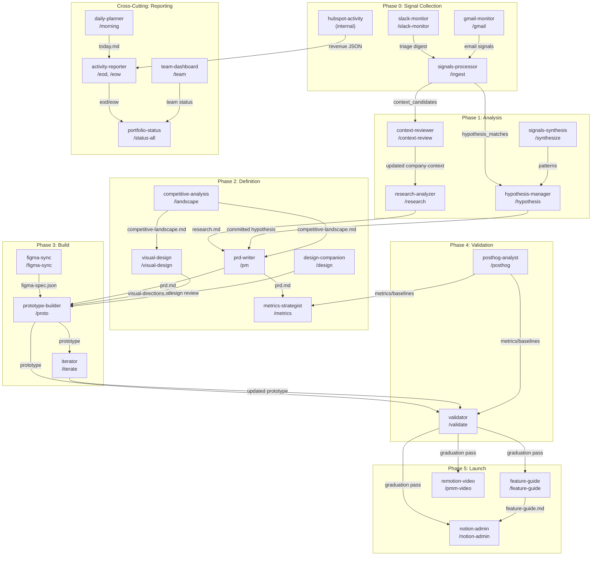
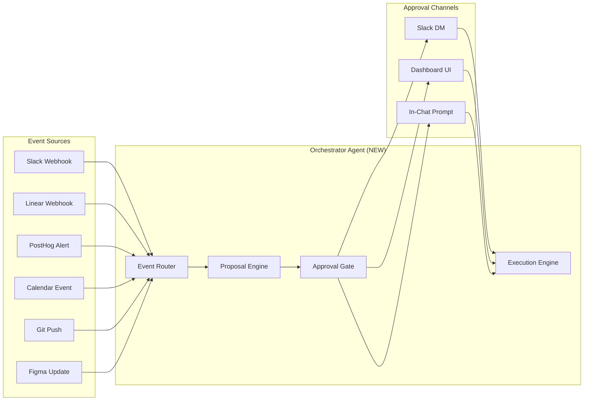

# Agent Architecture Map

> Generated: 2026-03-04
> Scope: 20 active agents, 67 commands, 5 rules, 36 skills (2 deprecated)
> Purpose: Complete map of agent triggers, context sources, tools, outputs, handoffs, human-in-the-loop points, and gaps

---

## Table of Contents

1. [System Overview](#1-system-overview)
2. [Product Lifecycle Pipeline](#2-product-lifecycle-pipeline)
3. [Per-Agent Detail Cards](#3-per-agent-detail-cards)
4. [Context Dependency Matrix](#4-context-dependency-matrix)
5. [Command-to-Agent Routing Table](#5-command-to-agent-routing-table)
6. [MCP Tool Usage Matrix](#6-mcp-tool-usage-matrix)
7. [Human-in-the-Loop Model](#7-human-in-the-loop-model)
8. [Gap Analysis](#8-gap-analysis)
9. [Automation Readiness Assessment](#9-automation-readiness-assessment)

---

## 1. System Overview

The PM workspace operates as a multi-agent system where 20 specialized agents collaborate across the full product lifecycle. Each agent is triggered by slash commands, consumes context from `pm-workspace-docs/`, calls external services via MCP, and produces artifacts that downstream agents consume.

### Architecture Layers

| Layer             | Components                                                                        | Purpose                                               |
| ----------------- | --------------------------------------------------------------------------------- | ----------------------------------------------------- |
| **Rules** (5)     | pm-foundation, component-patterns, cursor-admin, growth-companion, remotion-video | Behavioral guardrails and context injection           |
| **Commands** (67) | Slash commands in `.cursor/commands/`                                             | User-facing entry points that route to agents/skills  |
| **Skills** (36)   | Reusable modules in `.cursor/skills/`                                             | Domain expertise consumed by agents or commands       |
| **Agents** (20)   | Subagents in `.cursor/agents/`                                                    | Autonomous workers with memory, tools, and MCP access |
| **Data**          | `pm-workspace-docs/`                                                              | Canonical context, signals, initiatives, roadmap      |
| **External**      | MCP servers (composio, linear, posthog, hubspot, google, notion, figma, ansor)    | External service integrations                         |

### Always-On Foundation

The `pm-foundation` rule (`alwaysApply: true`) loads four files before any PM work:

- `company-context/product-vision.md` -- what AskElephant is and where it's going
- `company-context/strategic-guardrails.md` -- what we will NOT do
- `company-context/tyler-context.md` -- Tyler's role, team, preferences
- `company-context/org-chart.md` -- team structure and Slack ID resolution

This foundation provides strategic alignment checking, push-back capability, and communication routing for every agent.

---

## 2. Product Lifecycle Pipeline

Agents chain together along a product lifecycle. Arrows show data flow, not direct invocation -- each step requires a human trigger (slash command) unless otherwise noted.

### Phase-to-Agent Mapping

| Lifecycle Phase       | Agents/Skills Involved                                                                | Key Artifacts Produced                                                              |
| --------------------- | ------------------------------------------------------------------------------------- | ----------------------------------------------------------------------------------- |
| **Signal Collection** | slack-monitor, gmail-monitor, signals-processor, hubspot-activity                     | `signals/` files, `_index.json` entries                                             |
| **Analysis**          | context-reviewer, research-analyzer, signals-synthesis, hypothesis-manager            | Updated `company-context/`, `research.md`, `hypotheses/`                            |
| **Definition**        | prd-writer, metrics-strategist, competitive-analysis, visual-design, design-companion | `prd.md`, `success-criteria.md`, `competitive-landscape.md`, `visual-directions.md` |
| **Build**             | prototype-builder, figma-sync, iterator                                               | Prototype components, `prototype-notes.md`, Chromatic deploy                        |
| **Validation**        | validator, posthog-analyst                                                            | `jury-evaluations/`, graduation verdict, dashboards                                 |
| **Launch**            | feature-guide, remotion-video, notion-admin                                           | `feature-guides/`, Remotion videos, Notion project pages                            |
| **Reporting**         | activity-reporter, daily-planner, team-dashboard, portfolio-status                    | `eod/`, `eow/`, `today.md`, `status-all.md`                                         |

---

## 3. Per-Agent Detail Cards

### 3.1 signals-processor

| Field                | Details                                                                                                                                                                     |
| -------------------- | --------------------------------------------------------------------------------------------------------------------------------------------------------------------------- |
| **File**             | `.cursor/agents/signals-processor.md`                                                                                                                                       |
| **Model**            | sonnet                                                                                                                                                                      |
| **Trigger**          | `/ingest [source]`, `/synthesize [topic]`                                                                                                                                   |
| **Human Gate**       | Confirm before execution                                                                                                                                                    |
| **Memory**           | project                                                                                                                                                                     |
| **MCP Servers**      | ansor (frontmatter); composio-config, linear, posthog, hubspot (in body)                                                                                                    |
| **Context Sources**  | `company-context/product-vision.md`, `company-context/personas.md`, `company-context/strategic-guardrails.md`, `signals/_index.json`, `hypotheses/_index.json`              |
| **Skills**           | feature-availability (with `--customer-check`), ansor-memory (Product OS writes)                                                                                            |
| **Work Done**        | Ingests signals from Slack, Linear, HubSpot, transcripts, conversations. Categorizes, extracts problems/features/decisions/actions, matches to hypotheses, writes to Ansor. |
| **Output Artifacts** | Signal files in `signals/[type]/`, `_index.json` updates, context_candidates for context-reviewer, hypothesis_candidates                                                    |
| **Downstream**       | context-reviewer (context candidates), hypothesis-manager (hypothesis matches), activity-reporter (signal counts)                                                           |
| **Gaps**             | Only agent writing to Ansor; no auto-trigger from slack-monitor "Capture" items                                                                                             |

---

### 3.2 slack-monitor

| Field                | Details                                                                                                                                                     |
| -------------------- | ----------------------------------------------------------------------------------------------------------------------------------------------------------- |
| **File**             | `.cursor/agents/slack-monitor.md`                                                                                                                           |
| **Model**            | haiku                                                                                                                                                       |
| **Trigger**          | `/slack-monitor`, `/triage`, `/triage slack`, intent: "what's happening on Slack?"                                                                          |
| **Human Gate**       | Auto-run                                                                                                                                                    |
| **Memory**           | project                                                                                                                                                     |
| **MCP Servers**      | composio-config (SLACK_SEARCH_MESSAGES, SLACK_FETCH_CONVERSATION_HISTORY, thread/reaction tools)                                                            |
| **Context Sources**  | `company-context/org-chart.md`, `company-context/tyler-context.md`, `audits/slack-communication-routing-guide.md`, `status/slack/.slack-monitor-state.json` |
| **Skills**           | None                                                                                                                                                        |
| **Work Done**        | Scans Slack channels (tiered: revenue, engineering, product, leadership), checks if Tyler replied, classifies messages: Act/Decide/Aware/Capture/Follow Up  |
| **Output Artifacts** | Triage digest markdown, updated `.slack-monitor-state.json`                                                                                                 |
| **Downstream**       | signals-processor (manual: "Capture" items need manual `/ingest`), activity-reporter (digest content)                                                       |
| **Gaps**             | "Capture" items do not auto-feed into signals-processor                                                                                                     |

---

### 3.3 gmail-monitor

| Field                | Details                                                                                                                                                                       |
| -------------------- | ----------------------------------------------------------------------------------------------------------------------------------------------------------------------------- |
| **File**             | `.cursor/agents/gmail-monitor.md`                                                                                                                                             |
| **Model**            | haiku                                                                                                                                                                         |
| **Trigger**          | `/gmail`, `/triage email`, intent: "check my email", "triage email"                                                                                                           |
| **Human Gate**       | Auto-run                                                                                                                                                                      |
| **Memory**           | project                                                                                                                                                                       |
| **MCP Servers**      | google (Gmail tools)                                                                                                                                                          |
| **Context Sources**  | `company-context/org-chart.md`, `company-context/tyler-context.md`, `status/gmail/.gmail-monitor-state.json`                                                                  |
| **Skills**           | None                                                                                                                                                                          |
| **Work Done**        | Scans Gmail, classifies by sender priority (leadership > collaborators > external), applies labels (PM/Act, PM/Decide, PM/Aware, PM/Capture), creates drafts, cleanup actions |
| **Output Artifacts** | Triage digest, Gmail labels applied, draft replies, `.gmail-monitor-state.json`                                                                                               |
| **Downstream**       | activity-reporter (email digest)                                                                                                                                              |
| **Gaps**             | No signal capture path to signals-processor                                                                                                                                   |

---

### 3.4 hubspot-activity

| Field                | Details                                                                                           |
| -------------------- | ------------------------------------------------------------------------------------------------- |
| **File**             | `.cursor/agents/hubspot-activity.md`                                                              |
| **Model**            | haiku                                                                                             |
| **Trigger**          | Called internally by activity-reporter skill (never invoked directly)                             |
| **Human Gate**       | N/A (internal)                                                                                    |
| **MCP Servers**      | hubspot                                                                                           |
| **Tools**            | Read, Grep, Glob, Bash only (disallowedTools: Write, Edit)                                        |
| **Context Sources**  | `company-context/org-chart.md` (team mapping)                                                     |
| **Skills**           | None                                                                                              |
| **Work Done**        | Pulls deals closed/lost, meetings booked, expansion data from HubSpot. Maps owners via org-chart. |
| **Output Artifacts** | JSON: deals, meetings, metrics, by-rep breakdown; Markdown summary for reports                    |
| **Downstream**       | activity-reporter (revenue section of EOD/EOW)                                                    |
| **Gaps**             | Read-only by design; no revenue signals fed back to signals-processor                             |

---

### 3.5 context-reviewer

| Field                | Details                                                                                                                                                              |
| -------------------- | -------------------------------------------------------------------------------------------------------------------------------------------------------------------- |
| **File**             | `.cursor/agents/context-reviewer.md`                                                                                                                                 |
| **Model**            | inherit                                                                                                                                                              |
| **Trigger**          | `/context-review` (after `/ingest` produces context_candidates)                                                                                                      |
| **Human Gate**       | Interactive: approve/reject/skip each candidate                                                                                                                      |
| **MCP Servers**      | None                                                                                                                                                                 |
| **Context Sources**  | `signals/_index.json`, signal files, `company-context/*`, `roadmap/roadmap.json`                                                                                     |
| **Skills**           | None                                                                                                                                                                 |
| **Work Done**        | Scans context_candidates from ingested signals, groups by target doc, presents each for human approval. Update types: add_quote, add_item, add_note, update_section. |
| **Output Artifacts** | Updated `company-context/` files, `roadmap.json` updates, `company-context/CHANGELOG.md` entries, index status updates                                               |
| **Downstream**       | All agents (via updated company-context), roadmap-analysis (via roadmap.json)                                                                                        |
| **Gaps**             | No automation: requires human for every candidate. roadmap.json only updated here and by generate-roadmap.py                                                         |

---

### 3.6 research-analyzer

| Field                | Details                                                                                                                                                                                       |
| -------------------- | --------------------------------------------------------------------------------------------------------------------------------------------------------------------------------------------- |
| **File**             | `.cursor/agents/research-analyzer.md`                                                                                                                                                         |
| **Model**            | sonnet                                                                                                                                                                                        |
| **Trigger**          | `/research [initiative-name]`                                                                                                                                                                 |
| **Human Gate**       | Confirm before execution                                                                                                                                                                      |
| **Memory**           | project                                                                                                                                                                                       |
| **MCP Servers**      | composio-config (Slack, HubSpot, Linear, Notion, PostHog)                                                                                                                                     |
| **Context Sources**  | `company-context/product-vision.md`, `company-context/strategic-guardrails.md`, `company-context/personas.md`                                                                                 |
| **Skills**           | None (research-analyst skill is the same content)                                                                                                                                             |
| **Work Done**        | Analyzes transcripts, interviews, customer feedback. Produces: TL;DR, strategic alignment score, red flags, decisions, actions, problems, feature ideas, JTBD, user breakdown, feedback plan. |
| **Output Artifacts** | `initiatives/active/[name]/research.md`, JSON summary for workflow integration                                                                                                                |
| **Downstream**       | prd-writer (consumes research.md), hypothesis-manager (problems may become hypotheses)                                                                                                        |
| **Gaps**             | Does not write evidence to Ansor; no auto-trigger from new transcript signals                                                                                                                 |

---

### 3.7 hypothesis-manager

| Field                | Details                                                                                                                                              |
| -------------------- | ---------------------------------------------------------------------------------------------------------------------------------------------------- |
| **File**             | `.cursor/agents/hypothesis-manager.md`                                                                                                               |
| **Model**            | haiku                                                                                                                                                |
| **Trigger**          | `/hypothesis [subcommand]` -- new, validate, commit, retire, list, show                                                                              |
| **Human Gate**       | Confirm before execution                                                                                                                             |
| **MCP Servers**      | None                                                                                                                                                 |
| **Context Sources**  | `hypotheses/_template.md`, `hypotheses/_index.json`, `hypotheses/active/`, `hypotheses/validated/`, `hypotheses/committed/`, `hypotheses/retired/`   |
| **Skills**           | None                                                                                                                                                 |
| **Work Done**        | Manages hypothesis lifecycle: active (problem statement + evidence) -> validated (3+ evidence sources) -> committed (creates initiative) -> retired. |
| **Output Artifacts** | Hypothesis files in `hypotheses/[status]/`, `_index.json` updates; on commit: new initiative folder via `/new-initiative`                            |
| **Downstream**       | prd-writer (committed hypothesis seeds PRD), new-initiative (folder creation)                                                                        |
| **Gaps**             | Does not write decisions to Ansor; no auto-validation when evidence threshold reached                                                                |

---

### 3.8 metrics-strategist

| Field                | Details                                                                                                                                                                                  |
| -------------------- | ---------------------------------------------------------------------------------------------------------------------------------------------------------------------------------------- |
| **File**             | `.cursor/agents/metrics-strategist.md`                                                                                                                                                   |
| **Model**            | inherit                                                                                                                                                                                  |
| **Trigger**          | `/metrics [initiative-name]`, implicitly during Define phase                                                                                                                             |
| **Human Gate**       | Implicit (triggered during phase work)                                                                                                                                                   |
| **MCP Servers**      | None                                                                                                                                                                                     |
| **Context Sources**  | Initiative brief, PRD, feature description (runtime input)                                                                                                                               |
| **Skills**           | None                                                                                                                                                                                     |
| **Work Done**        | Produces 5-layer Success Criteria Framework: outcome chain, metrics map, causal attribution, guardrails, anti-metrics. Uses AskQuestion when Business Outcome or Target Persona unclear. |
| **Output Artifacts** | `initiatives/active/[name]/success-criteria.md`                                                                                                                                          |
| **Downstream**       | posthog-analyst (metrics inform dashboards/alerts), validator (graduation criteria)                                                                                                      |
| **Gaps**             | No connection to PostHog for baseline establishment; output is documentation only                                                                                                        |

---

### 3.9 prototype-builder

| Field                | Details                                                                                                                                                                                                                                                                                                                                   |
| -------------------- | ----------------------------------------------------------------------------------------------------------------------------------------------------------------------------------------------------------------------------------------------------------------------------------------------------------------------------------------- |
| **File**             | `.cursor/agents/prototype-builder.md`                                                                                                                                                                                                                                                                                                     |
| **Model**            | inherit                                                                                                                                                                                                                                                                                                                                   |
| **Trigger**          | `/proto [initiative-name]`, `/proto [name] --lofi`                                                                                                                                                                                                                                                                                        |
| **Human Gate**       | Confirm before execution                                                                                                                                                                                                                                                                                                                  |
| **MCP Servers**      | None (Figma MCP used for FigJam in full mode)                                                                                                                                                                                                                                                                                             |
| **Context Sources**  | `company-context/product-vision.md`, `initiatives/active/[name]/prd.md`, `initiatives/active/[name]/design-brief.md`, `.cursor/skills/prototype-system/component-registry.md`, `.cursor/skills/prototype-system/interactive-patterns.md`, `initiatives/active/[name]/figma-language.md`, `initiatives/active/[name]/visual-directions.md` |
| **Skills**           | prototype-system (component-registry, interactive-patterns), prototype-notification (Slack DM after build)                                                                                                                                                                                                                                |
| **Work Done**        | Pre-flight checks (codebase, placement, component inventory). Builds production-fidelity Storybook prototypes with app shell, semantic tokens, interactive flows. Full mode: 5 flow types (Discovery, Onboarding, HappyPath, ErrorRecovery, DayTwo), AI states, Chromatic deploy. Lofi: happy path only.                                  |
| **Output Artifacts** | Components in `elephant-ai/apps/web/src/components/prototypes/[Initiative]/v1/`, `prototype-notes.md`, Chromatic URL, Slack DM, FigJam customer story                                                                                                                                                                                     |
| **Downstream**       | iterator (feedback loop), validator (jury evaluation), design-handoff (designer refinement)                                                                                                                                                                                                                                               |
| **Gaps**             | No auto-trigger from PRD completion; Chromatic deploy requires manual verification                                                                                                                                                                                                                                                        |

---

### 3.10 iterator

| Field                | Details                                                                                                                                                                                        |
| -------------------- | ---------------------------------------------------------------------------------------------------------------------------------------------------------------------------------------------- |
| **File**             | `.cursor/agents/iterator.md`                                                                                                                                                                   |
| **Model**            | inherit                                                                                                                                                                                        |
| **Trigger**          | `/iterate [initiative-name]`                                                                                                                                                                   |
| **Human Gate**       | Confirm; interactive for patch vs version bump decision                                                                                                                                        |
| **MCP Servers**      | None                                                                                                                                                                                           |
| **Context Sources**  | `initiatives/active/[name]/_meta.json`, `prd.md`, `design-brief.md`, `prototype-notes.md`, `initiatives/active/[name]/jury-evaluations/`, `.cursor/skills/prototype-system/`                   |
| **Skills**           | prototype-system                                                                                                                                                                               |
| **Work Done**        | Auto-pulls signals from `signals/_index.json`. Extracts feedback actions. Applies as patch (small changes) or version bump (large changes, new `vN+1` folder). Uses AskQuestion for conflicts. |
| **Output Artifacts** | Updated prototype components, `prototype-notes.md` updates, Chromatic deploy (version bumps only)                                                                                              |
| **Downstream**       | validator (updated prototype for re-evaluation)                                                                                                                                                |
| **Gaps**             | No auto-trigger from jury evaluation "contested" results                                                                                                                                       |

---

### 3.11 validator

| Field                | Details                                                                                                                                                                                    |
| -------------------- | ------------------------------------------------------------------------------------------------------------------------------------------------------------------------------------------ |
| **File**             | `.cursor/agents/validator.md`                                                                                                                                                              |
| **Model**            | inherit                                                                                                                                                                                    |
| **Trigger**          | `/validate [initiative-name]`, options: `--phase [phase]`, `--criteria-only`                                                                                                               |
| **Human Gate**       | Confirm before execution                                                                                                                                                                   |
| **Memory**           | project                                                                                                                                                                                    |
| **MCP Servers**      | None                                                                                                                                                                                       |
| **Context Sources**  | `initiatives/active/[name]/_meta.json`, `prd.md`, `prototype-notes.md`, `personas/archetypes/`, `.cursor/skills/prototype-system/SKILL.md`                                                 |
| **Skills**           | prototype-system (Build->Validate checklist)                                                                                                                                               |
| **Work Done**        | Condorcet jury evaluation with stratified personas (Rep 40%, Leader 25%, CSM 20%, RevOps 15%; includes skeptics). Phase-specific graduation criteria. JSON verdict: pass/contested/reject. |
| **Output Artifacts** | `jury-evaluations/` reports, JSON verdict, `_meta.json` graduation updates                                                                                                                 |
| **Downstream**       | iterator (contested -> iterate), feature-guide/remotion-video/notion-admin (pass -> launch), \_meta.json phase update (manual)                                                             |
| **Gaps**             | Does not auto-advance phase in `_meta.json`; no auto-trigger of downstream launch agents on pass                                                                                           |

---

### 3.12 posthog-analyst

| Field                | Details                                                                                                                                                                                                                                             |
| -------------------- | --------------------------------------------------------------------------------------------------------------------------------------------------------------------------------------------------------------------------------------------------- |
| **File**             | `.cursor/agents/posthog-analyst.md`                                                                                                                                                                                                                 |
| **Model**            | inherit                                                                                                                                                                                                                                             |
| **Trigger**          | `/posthog [mode]` -- 13 modes: audit, dashboard, metrics, cohorts, alerts, instrument, question, instrument-check, north-star, health, aha-moment, churn-risk, expansion                                                                            |
| **Human Gate**       | Varies by mode (most confirm, `question` is auto)                                                                                                                                                                                                   |
| **MCP Servers**      | PostHog MCP tools (dashboards, insights, flags, events, cohorts, feature flags, queries)                                                                                                                                                            |
| **Context Sources**  | `company-context/product-vision.md`, `company-context/personas.md`, `company-context/strategic-guardrails.md`, `audits/posthog-audit-2026-01-23.md`, `research/posthog-best-practices-sachin.md`, `status/posthog/analysis/posthog-value-ladder.md` |
| **Skills**           | None                                                                                                                                                                                                                                                |
| **Work Done**        | Analytics lifecycle management. Creates/audits dashboards, defines cohorts, sets up alerts, instruments features, answers data questions, defines North Star and health scores.                                                                     |
| **Output Artifacts** | PostHog dashboards/insights/cohorts/alerts, markdown reports in `pm-workspace-docs/` (varies by mode)                                                                                                                                               |
| **Downstream**       | metrics-strategist (baselines), validator (quantitative evidence for graduation)                                                                                                                                                                    |
| **Gaps**             | No auto-alert routing back to signals-processor; PostHog alerts don't trigger workspace actions                                                                                                                                                     |

---

### 3.13 figma-sync

| Field                | Details                                                                                                                                                            |
| -------------------- | ------------------------------------------------------------------------------------------------------------------------------------------------------------------ |
| **File**             | `.cursor/agents/figma-sync.md`                                                                                                                                     |
| **Model**            | inherit                                                                                                                                                            |
| **Trigger**          | `/figma-sync [initiative-name] [figma-url]`, option: `--exact`                                                                                                     |
| **Human Gate**       | Confirm before execution                                                                                                                                           |
| **MCP Servers**      | Figma MCP (get_design_context, get_metadata, get_variable_defs)                                                                                                    |
| **Context Sources**  | `.interface-design/system.md`, `elephant-ai/web/src/components/` (existing components)                                                                             |
| **Skills**           | prototype-system (canonical structure, component registry)                                                                                                         |
| **Work Done**        | Extracts Figma designs, creates design-language pass (file-level links), cross-references production components, scaffolds React components and Storybook stories. |
| **Output Artifacts** | `figma-spec.json`, `figma-language.md`, `figma-sync-log.md`, component scaffolds in `elephant-ai/.../prototypes/[Initiative]/v1/`                                  |
| **Downstream**       | prototype-builder (consumes figma-spec.json and figma-language.md)                                                                                                 |
| **Gaps**             | No auto-trigger from Figma webhook; requires manual URL input                                                                                                      |

---

### 3.14 figjam-generator

| Field                | Details                                                                                                                                                                           |
| -------------------- | --------------------------------------------------------------------------------------------------------------------------------------------------------------------------------- |
| **File**             | `.cursor/agents/figjam-generator.md`                                                                                                                                              |
| **Model**            | haiku                                                                                                                                                                             |
| **Trigger**          | `/figjam [description]`                                                                                                                                                           |
| **Human Gate**       | Auto-run                                                                                                                                                                          |
| **MCP Servers**      | figma (generate_diagram)                                                                                                                                                          |
| **Context Sources**  | None                                                                                                                                                                              |
| **Skills**           | None                                                                                                                                                                              |
| **Work Done**        | Converts description to Mermaid syntax, generates FigJam diagram. Supports: flowchart, sequence, state, Gantt, decision tree. Does NOT support: class diagrams, ERDs, pie charts. |
| **Output Artifacts** | FigJam diagram URL                                                                                                                                                                |
| **Downstream**       | Used ad-hoc by other agents (prototype-builder generates customer story FigJams)                                                                                                  |
| **Gaps**             | None significant; utility agent                                                                                                                                                   |

---

### 3.15 notion-admin

| Field                | Details                                                                                                                                                                                                                 |
| -------------------- | ----------------------------------------------------------------------------------------------------------------------------------------------------------------------------------------------------------------------- |
| **File**             | `.cursor/agents/notion-admin.md`                                                                                                                                                                                        |
| **Model**            | sonnet                                                                                                                                                                                                                  |
| **Trigger**          | `/notion-admin [mode]`, `/full-sync`                                                                                                                                                                                    |
| **Human Gate**       | Confirm; interactive for full-sync gap resolution                                                                                                                                                                       |
| **MCP Servers**      | notion (NOTION_QUERY_DATABASE, NOTION_FETCH_DATABASE, NOTION_RETRIEVE_PAGE, NOTION_UPDATE_PAGE, NOTION_CREATE_NOTION_PAGE)                                                                                              |
| **Context Sources**  | Notion database IDs (Projects: `2c0f79b2-c8ac-802c-8b15-c84a8fce3513`, Launch Planning, Roadmap, etc.)                                                                                                                  |
| **Skills**           | notion-admin skill                                                                                                                                                                                                      |
| **Work Done**        | Modes: audit (health check), projects (CRUD), launches (tracking), prd (create Notion PRD page), eow (sync EOW to Notion), flags (feature flag tracking), full-sync (bidirectional sync), sync-gtm (GTM notifications). |
| **Output Artifacts** | Notion pages/updates, audit reports, sync reports in `status/notion/admin/`                                                                                                                                             |
| **Downstream**       | None (terminal agent for launch phase)                                                                                                                                                                                  |
| **Gaps**             | No auto-sync trigger; requires manual `/full-sync` or `/notion-admin`                                                                                                                                                   |

---

### 3.16 linear-triage

| Field                | Details                                                                                                                                                    |
| -------------------- | ---------------------------------------------------------------------------------------------------------------------------------------------------------- |
| **File**             | `.cursor/agents/linear-triage.md`                                                                                                                          |
| **Model**            | sonnet                                                                                                                                                     |
| **Trigger**          | `/epd-triage`, option: `--apply`                                                                                                                           |
| **Human Gate**       | Confirm; optional `--apply` for safe changes                                                                                                               |
| **MCP Servers**      | linear (LINEAR_LIST_LINEAR_TEAMS, LINEAR_LIST_LINEAR_STATES, LINEAR_LIST_ISSUES_BY_TEAM_ID, LINEAR_UPDATE_ISSUE, LINEAR_CREATE_LINEAR_COMMENT)             |
| **Context Sources**  | Linear EPD team (team ID from pm-foundation rule)                                                                                                          |
| **Skills**           | None                                                                                                                                                       |
| **Work Done**        | EPD/Product triage only (never touches Engineering team). Classifies: Ready for Backlog, Needs Info, Needs Engineering Handoff, Possible Duplicate, Defer. |
| **Output Artifacts** | Triage report, optional Linear issue updates (with `--apply`)                                                                                              |
| **Downstream**       | None (human acts on triage recommendations)                                                                                                                |
| **Gaps**             | No connection to signals-processor for "Needs Info" items                                                                                                  |

---

### 3.17 feature-guide

| Field                | Details                                                                                                                                                                                           |
| -------------------- | ------------------------------------------------------------------------------------------------------------------------------------------------------------------------------------------------- |
| **File**             | `.cursor/agents/feature-guide.md`                                                                                                                                                                 |
| **Model**            | inherit                                                                                                                                                                                           |
| **Trigger**          | `/feature-guide [feature-name]`                                                                                                                                                                   |
| **Human Gate**       | Confirm before execution                                                                                                                                                                          |
| **MCP Servers**      | composio-config (SLACK_SEARCH_MESSAGES, SLACK_FETCH_CONVERSATION_HISTORY), GitHub, Linear                                                                                                         |
| **Context Sources**  | `initiatives/[initiative]/` (all docs), `signals/`, `research/`                                                                                                                                   |
| **Skills**           | None                                                                                                                                                                                              |
| **Work Done**        | Builds customer-facing feature documentation from Slack threads, GitHub PRs, Linear issues, and initiative docs. Sections: Overview, Who, Where, How, FAQ, Troubleshooting, Release, Limitations. |
| **Output Artifacts** | `pm-workspace-docs/feature-guides/<slug>.md`                                                                                                                                                      |
| **Downstream**       | notion-admin (can publish to Notion)                                                                                                                                                              |
| **Gaps**             | No auto-trigger from validator pass; no templated publishing to help docs                                                                                                                         |

---

### 3.18 remotion-video

| Field                | Details                                                                                                                                                        |
| -------------------- | -------------------------------------------------------------------------------------------------------------------------------------------------------------- |
| **File**             | `.cursor/agents/remotion-video.md`                                                                                                                             |
| **Model**            | inherit                                                                                                                                                        |
| **Trigger**          | `/pmm-video [initiative-name]`                                                                                                                                 |
| **Human Gate**       | Interactive (AskQuestion intake: must-haves, exclusions, tone, length)                                                                                         |
| **MCP Servers**      | None                                                                                                                                                           |
| **Context Sources**  | `company-context/product-vision.md`, `company-context/strategic-guardrails.md`, `initiatives/active/[name]/prd.md`, `prototype-notes.md`, `pmm-video-brief.md` |
| **Skills**           | None                                                                                                                                                           |
| **Work Done**        | Interactive intake, brief generation, Remotion composition creation. Quality gates: outcome chain, evidence, persona, 30-90s.                                  |
| **Output Artifacts** | `remotion-pmm/briefs/[initiative].json`, Remotion composition in `remotion-pmm/src/`, `status/videos/README.md` entry                                          |
| **Downstream**       | None (terminal; requires PMM/Marketing review before publish)                                                                                                  |
| **Gaps**             | No auto-trigger from validator pass                                                                                                                            |

---

### 3.19 docs-generator

| Field                | Details                                                                                                                                                                                                 |
| -------------------- | ------------------------------------------------------------------------------------------------------------------------------------------------------------------------------------------------------- |
| **File**             | `.cursor/agents/docs-generator.md`                                                                                                                                                                      |
| **Model**            | inherit                                                                                                                                                                                                 |
| **Trigger**          | `/agents [path-to-component]`                                                                                                                                                                           |
| **Human Gate**       | Confirm before execution                                                                                                                                                                                |
| **MCP Servers**      | None                                                                                                                                                                                                    |
| **Context Sources**  | `company-context/product-vision.md`, `company-context/personas.md`, target source code directory                                                                                                        |
| **Skills**           | agents-generator                                                                                                                                                                                        |
| **Work Done**        | Analyzes source code directory, cross-references product context, generates product-focused AGENTS.md with: Product Context, Personas, Key Flows, Trust & Experience, Technical Context, AI Guidelines. |
| **Output Artifacts** | `pm-workspace-docs/agents-docs/[path]/AGENTS.md` (mirrors source structure)                                                                                                                             |
| **Downstream**       | None (documentation artifact)                                                                                                                                                                           |
| **Gaps**             | None significant                                                                                                                                                                                        |

---

### 3.20 workspace-admin

| Field                | Details                                                                                                                                                                |
| -------------------- | ---------------------------------------------------------------------------------------------------------------------------------------------------------------------- |
| **File**             | `.cursor/agents/workspace-admin.md`                                                                                                                                    |
| **Model**            | sonnet                                                                                                                                                                 |
| **Trigger**          | `/maintain [subcommand]`, `/admin [subcommand]`                                                                                                                        |
| **Human Gate**       | Auto-run for audit; confirm for changes                                                                                                                                |
| **MCP Servers**      | None                                                                                                                                                                   |
| **Context Sources**  | `.cursor/` configuration files (ignores PM context in admin mode)                                                                                                      |
| **Skills**           | None                                                                                                                                                                   |
| **Work Done**        | Maintenance: audit (structure check), fix (auto-fix safe issues), sync (regenerate indexes), clean (remove stale). Admin: CRUD for rules, commands, skills, subagents. |
| **Output Artifacts** | `maintenance/latest-audit.md`, regenerated indexes, roadmap regeneration                                                                                               |
| **Downstream**       | All agents (via regenerated indexes and fixed config)                                                                                                                  |
| **Gaps**             | Does not auto-run on schedule; roadmap.json regeneration not wired to audit                                                                                            |

---

## 4. Context Dependency Matrix

### 4.1 What Each Agent Reads

| Context File                                         | Agents That Read It                                                                                                                                                   |
| ---------------------------------------------------- | --------------------------------------------------------------------------------------------------------------------------------------------------------------------- |
| `company-context/product-vision.md`                  | signals-processor, research-analyzer, prototype-builder, posthog-analyst, remotion-video, docs-generator, prd-writer, metrics-strategist (via ALL PM work foundation) |
| `company-context/strategic-guardrails.md`            | signals-processor, research-analyzer, posthog-analyst, remotion-video, prd-writer (via foundation)                                                                    |
| `company-context/tyler-context.md`                   | slack-monitor, gmail-monitor (via foundation)                                                                                                                         |
| `company-context/org-chart.md`                       | slack-monitor, gmail-monitor, hubspot-activity (via foundation)                                                                                                       |
| `company-context/personas.md`                        | signals-processor, research-analyzer, posthog-analyst, docs-generator, validator                                                                                      |
| `signals/_index.json`                                | signals-processor, context-reviewer, iterator                                                                                                                         |
| `hypotheses/_index.json`                             | signals-processor, hypothesis-manager                                                                                                                                 |
| `initiatives/active/[name]/_meta.json`               | validator, iterator, initiative-status, portfolio-status, roadmap-analysis                                                                                            |
| `initiatives/active/[name]/prd.md`                   | prototype-builder, iterator, validator, metrics-strategist, remotion-video                                                                                            |
| `initiatives/active/[name]/research.md`              | prd-writer, validator                                                                                                                                                 |
| `initiatives/active/[name]/design-brief.md`          | prototype-builder, iterator, visual-design                                                                                                                            |
| `initiatives/active/[name]/prototype-notes.md`       | iterator, validator, remotion-video                                                                                                                                   |
| `initiatives/active/[name]/visual-directions.md`     | prototype-builder                                                                                                                                                     |
| `initiatives/active/[name]/competitive-landscape.md` | prd-writer, visual-design                                                                                                                                             |
| `roadmap/roadmap.json`                               | context-reviewer, roadmap-analysis, portfolio-status, daily-planner                                                                                                   |
| `audits/slack-communication-routing-guide.md`        | slack-monitor                                                                                                                                                         |
| `personas/archetypes/`                               | validator (jury system)                                                                                                                                               |

### 4.2 What Each Agent Writes

| Context File                                         | Agent That Writes It                               |
| ---------------------------------------------------- | -------------------------------------------------- |
| `signals/[type]/*.md`                                | signals-processor                                  |
| `signals/_index.json`                                | signals-processor                                  |
| `company-context/*.md`                               | context-reviewer                                   |
| `company-context/CHANGELOG.md`                       | context-reviewer                                   |
| `roadmap/roadmap.json`                               | context-reviewer, generate-roadmap.py (script)     |
| `hypotheses/[status]/*.md`                           | hypothesis-manager                                 |
| `hypotheses/_index.json`                             | hypothesis-manager                                 |
| `initiatives/active/[name]/research.md`              | research-analyzer                                  |
| `initiatives/active/[name]/prd.md`                   | prd-writer (skill)                                 |
| `initiatives/active/[name]/success-criteria.md`      | metrics-strategist                                 |
| `initiatives/active/[name]/prototype-notes.md`       | prototype-builder, iterator                        |
| `initiatives/active/[name]/competitive-landscape.md` | competitive-analysis (skill)                       |
| `initiatives/active/[name]/visual-directions.md`     | visual-design (skill)                              |
| `initiatives/active/[name]/jury-evaluations/`        | validator                                          |
| `initiatives/active/[name]/_meta.json`               | validator (graduation), sync agents (dev_activity) |
| `feature-guides/<slug>.md`                           | feature-guide                                      |
| `status/activity/eod/`                               | activity-reporter (skill)                          |
| `status/activity/eow/`                               | activity-reporter (skill)                          |
| `status/today.md`                                    | daily-planner (skill)                              |
| `status/slack/.slack-monitor-state.json`             | slack-monitor                                      |
| `status/gmail/.gmail-monitor-state.json`             | gmail-monitor                                      |
| `maintenance/latest-audit.md`                        | workspace-admin                                    |

---

## 5. Command-to-Agent Routing Table

### 5.1 Commands That Delegate to Agents

| Command           | Agent                         | Human Gate  |
| ----------------- | ----------------------------- | ----------- |
| `/ingest`         | signals-processor             | confirm     |
| `/synthesize`     | signals-processor             | confirm     |
| `/slack-monitor`  | slack-monitor                 | auto        |
| `/triage`         | slack-monitor + gmail-monitor | auto        |
| `/gmail`          | gmail-monitor                 | auto        |
| `/context-review` | context-reviewer              | interactive |
| `/research`       | research-analyzer             | confirm     |
| `/hypothesis`     | hypothesis-manager            | confirm     |
| `/metrics`        | metrics-strategist            | confirm     |
| `/proto`          | prototype-builder             | confirm     |
| `/iterate`        | iterator                      | confirm     |
| `/validate`       | validator                     | confirm     |
| `/posthog`        | posthog-analyst               | confirm     |
| `/figma-sync`     | figma-sync                    | confirm     |
| `/figjam`         | figjam-generator              | auto        |
| `/notion-admin`   | notion-admin                  | confirm     |
| `/full-sync`      | notion-admin                  | interactive |
| `/epd-triage`     | linear-triage                 | confirm     |
| `/feature-guide`  | feature-guide                 | confirm     |
| `/pmm-video`      | remotion-video                | interactive |
| `/agents`         | docs-generator                | confirm     |
| `/maintain`       | workspace-admin               | confirm     |
| `/admin`          | workspace-admin               | confirm     |

### 5.2 Commands That Use Skills (No Agent)

| Command               | Skill                                   | Human Gate |
| --------------------- | --------------------------------------- | ---------- |
| `/pm`                 | prd-writer                              | confirm    |
| `/design`             | design-companion                        | confirm    |
| `/design-handoff`     | design-companion                        | confirm    |
| `/visual-design`      | visual-design                           | confirm    |
| `/landscape`          | competitive-analysis                    | confirm    |
| `/status`             | initiative-status                       | auto       |
| `/status-all`         | portfolio-status                        | auto       |
| `/roadmap`            | roadmap-analysis                        | auto       |
| `/eod`                | activity-reporter                       | auto       |
| `/eow`                | activity-reporter                       | auto       |
| `/morning`            | daily-planner                           | auto       |
| `/block`              | daily-planner                           | auto       |
| `/team`               | team-dashboard                          | auto       |
| `/sync-notion`        | notion-sync                             | auto       |
| `/sync-linear`        | linear-sync                             | auto       |
| `/sync-github`        | github-sync                             | auto       |
| `/sync-dev`           | notion-sync + linear-sync + github-sync | auto       |
| `/brainstorm-board`   | brainstorm                              | confirm    |
| `/availability-check` | feature-availability                    | auto       |
| `/proto-audit`        | prototype-system                        | confirm    |
| `/placement`          | placement-analysis                      | confirm    |

### 5.3 Commands With No Agent or Skill (Direct Execution)

| Command             | Purpose                                | Human Gate  |
| ------------------- | -------------------------------------- | ----------- |
| `/save`             | Git stage, commit, push                | auto        |
| `/update`           | Git pull and submodule sync            | auto        |
| `/share`            | Create PR                              | confirm     |
| `/setup`            | One-time workspace setup               | confirm     |
| `/help`             | List commands                          | auto        |
| `/new-initiative`   | Create initiative folder from template | confirm     |
| `/merge-initiative` | Consolidate duplicate initiatives      | interactive |
| `/image`            | Generate image                         | auto        |
| `/mockup`           | Create HTML mockup                     | confirm     |
| `/design-system`    | View interface design system           | auto        |
| `/posthog-sql`      | PostHog SQL with schema awareness      | auto        |
| `/collab`           | Collaboration routing suggestions      | auto        |
| `/track`            | Create tracking item                   | auto        |
| `/track-bug`        | Track bug                              | auto        |
| `/track-idea`       | Track idea                             | auto        |
| `/plan`             | Create plan document                   | auto        |
| `/weekly-brief`     | Generate weekly brief for Notion       | auto        |
| `/engineer-profile` | Generate engineer profile              | confirm     |
| `/agent-team`       | Spin up parallel agent team            | interactive |
| `/write-tests`      | Add tests                              | auto        |
| `/user-research`    | Research template                      | auto        |
| `/analyze-code`     | Code analysis                          | auto        |

### 5.4 Deprecated Commands

| Command          | Replacement            |
| ---------------- | ---------------------- |
| `/lofi-proto`    | `/proto [name] --lofi` |
| `/context-proto` | `/proto [name]`        |

---

## 6. MCP Tool Usage Matrix

| MCP Server            | Agents Using It                                                    | Skills Using It                                                                                                | Key Tools                                                                        |
| --------------------- | ------------------------------------------------------------------ | -------------------------------------------------------------------------------------------------------------- | -------------------------------------------------------------------------------- |
| **composio-config**   | slack-monitor, signals-processor, research-analyzer, feature-guide | activity-reporter, slack-sync, slack-block-kit, notion-sync, notion-admin, linear-sync, prototype-notification | SLACK_SEARCH_MESSAGES, SLACK_FETCH_CONVERSATION_HISTORY, SLACK_SEND_MESSAGE      |
| **linear**            | linear-triage, signals-processor                                   | linear-sync, team-dashboard                                                                                    | LINEAR_LIST_ISSUES_BY_TEAM_ID, LINEAR_UPDATE_ISSUE, LINEAR_CREATE_LINEAR_COMMENT |
| **posthog**           | posthog-analyst                                                    | feature-availability                                                                                           | PostHog dashboards, insights, flags, events, cohorts, queries                    |
| **hubspot**           | hubspot-activity                                                   | --                                                                                                             | HubSpot deals, meetings, contacts                                                |
| **google**            | gmail-monitor                                                      | daily-planner                                                                                                  | Gmail (fetch, label, send), Calendar (list, create), Tasks                       |
| **notion**            | notion-admin                                                       | notion-sync, notion-admin                                                                                      | NOTION_QUERY_DATABASE, NOTION_UPDATE_PAGE, NOTION_CREATE_NOTION_PAGE             |
| **figma**             | figma-sync, figjam-generator                                       | figma-component-sync, prd-writer                                                                               | get_design_context, get_metadata, generate_diagram                               |
| **ansor**             | signals-processor                                                  | ansor-memory                                                                                                   | query_records, create_record, update_record (Product OS database)                |
| **user-ask-elephant** | -- (weekly-brief command)                                          | --                                                                                                             | search-calls-meetings                                                            |

### MCP Coverage Gaps

| Agent             | Uses MCP In Body But Not Frontmatter                                                 |
| ----------------- | ------------------------------------------------------------------------------------ |
| slack-monitor     | composio-config (Slack tools) -- not in mcpServers field                             |
| gmail-monitor     | google -- not in mcpServers field                                                    |
| hubspot-activity  | hubspot -- not in mcpServers field                                                   |
| research-analyzer | composio-config (Slack, HubSpot, Linear, Notion, PostHog) -- not in mcpServers field |
| feature-guide     | composio-config (Slack, GitHub, Linear) -- not in mcpServers field                   |
| notion-admin      | notion -- referenced in body only                                                    |
| linear-triage     | linear -- referenced in body only                                                    |

Only `signals-processor` (ansor) and `figjam-generator` (figma) declare MCP servers in their frontmatter. All other agents reference MCP tools in their body instructions, which may cause inconsistency if MCP server availability changes.

---

## 7. Human-in-the-Loop Model

### 7.1 Current Interaction Patterns

The system uses three interaction tiers, defined in the `pm-foundation` rule:

**Tier 1: Auto-Run** (no confirmation needed)

> `/save`, `/status`, `/roadmap`, `/team`, `/triage`, `/gmail`, `/slack-monitor`, `/morning`, `/eod`, `/eow`, `/help`, `/figjam`, `/sync-*`, `/block`, `/update`, `/availability-check`, `/weekly-brief`

These are read-heavy or low-risk operations. The human invokes them and gets immediate results.

**Tier 2: Confirm-First** (human approves before execution)

> `/research`, `/pm`, `/proto`, `/validate`, `/ingest`, `/figma-sync`, `/synthesize`, `/hypothesis`, `/feature-guide`, `/pmm-video`, `/agents`, `/landscape`, `/metrics`, `/maintain`, `/epd-triage`, `/design`, `/design-handoff`, `/visual-design`, `/brainstorm-board`, `/proto-audit`

These create or modify artifacts. The agent describes what it will do and waits for approval.

**Tier 3: Interactive** (multi-step human decisions)

> `/context-review` (approve/reject each candidate), `/iterate` (patch vs version), `/full-sync` (resolve gaps), `/merge-initiative` (confirm merge), `/brainstorm-board` (guide ideation), `/pmm-video` (intake questions), `/agent-team` (coordinate agents)

These require ongoing human judgment throughout execution.

### 7.2 What Changes for Full Automation

For a fully event-driven system, the following architectural additions would be needed:

**Key additions needed:**

1. **Orchestrator Agent** -- watches `_meta.json`, `signals/_index.json`, and external events; proposes next actions
2. **Event Router** -- maps external events (Slack messages, Linear updates, PostHog alerts) to agent triggers
3. **Approval Gate** -- presents proposals via Slack DM with approve/reject buttons
4. **Decision Logger** -- writes all approvals/rejections to Ansor for audit trail
5. **Schedule Runner** -- triggers time-based commands (`/morning` at 8am, `/eod` at 5pm, `/eow` Friday)

### 7.3 Automation Readiness by Agent

| Agent              | Current     | Automation Readiness | Blocking Issue                              |
| ------------------ | ----------- | -------------------- | ------------------------------------------- |
| slack-monitor      | Manual      | High                 | Needs webhook trigger                       |
| gmail-monitor      | Manual      | High                 | Needs schedule trigger                      |
| signals-processor  | Manual      | Medium               | Needs event routing from monitors           |
| context-reviewer   | Interactive | Low                  | Every candidate needs human judgment        |
| research-analyzer  | Manual      | Medium               | Needs transcript ingestion trigger          |
| hypothesis-manager | Manual      | Medium               | Needs auto-validation at evidence threshold |
| metrics-strategist | Manual      | Medium               | Needs phase-transition trigger              |
| prototype-builder  | Manual      | Low                  | Requires significant creative judgment      |
| iterator           | Manual      | Medium               | Could auto-trigger from jury "contested"    |
| validator          | Manual      | High                 | Could run on phase-gate schedule            |
| posthog-analyst    | Manual      | Medium               | Alert mode could be event-driven            |
| figma-sync         | Manual      | Low                  | Needs Figma webhook                         |
| figjam-generator   | Auto        | High                 | Already auto-run                            |
| notion-admin       | Manual      | Medium               | Could sync on schedule                      |
| linear-triage      | Manual      | High                 | Could run on Linear webhook                 |
| feature-guide      | Manual      | Medium               | Could auto-trigger from validator pass      |
| remotion-video     | Interactive | Low                  | Requires creative intake                    |
| docs-generator     | Manual      | Medium               | Could run on code merge                     |
| workspace-admin    | Manual      | High                 | Audit could run on schedule                 |
| hubspot-activity   | Internal    | High                 | Already auto-called                         |

---

## 8. Gap Analysis

### Gap 1: No Automated Phase Transitions

- **Severity:** HIGH
- **Issue:** `_meta.json` phase field is only updated manually or by `/validate --criteria-only`. No agent automatically advances an initiative when graduation criteria are met.
- **Impact:** The lifecycle pipeline breaks if a human forgets to update phase. Downstream agents that depend on phase (metrics-strategist in Define, prototype-builder in Build) have no trigger.
- **Recommendation:** Extend `validator` to auto-propose phase transitions with human approval via AskQuestion. Add phase-gate checks to `/status` output.

### Gap 2: Roadmap.json is Stale

- **Severity:** HIGH
- **Issue:** `roadmap/roadmap.json` is empty in this worktree. The `generate-roadmap.py` script exists but is not triggered by any agent or command.
- **Impact:** portfolio-status, daily-planner, and context-reviewer all read roadmap.json but get empty data.
- **Recommendation:** Wire `workspace-admin audit` to run `generate-roadmap.py` as part of its sync operation. Add a post-`/new-initiative` hook.

### Gap 3: Missing Orchestrator Agent

- **Severity:** HIGH (for full automation goal)
- **Issue:** No single agent coordinates the full lifecycle. Each agent is invoked independently via slash commands.
- **Impact:** The human must remember the correct sequence and timing of commands. No automatic downstream triggering.
- **Recommendation:** Build an orchestrator agent that: (1) watches `_meta.json` changes, (2) proposes next actions based on phase and artifact completeness, (3) waits for approval, (4) triggers downstream agents.

### Gap 4: Slack-Monitor to Signals-Processor Handoff is Manual

- **Severity:** MEDIUM
- **Issue:** slack-monitor produces "Capture" items in its digest, but these do not auto-feed into signals-processor.
- **Impact:** Signals from Slack require double handling: first triage, then manual `/ingest slack`.
- **Recommendation:** Add `--capture-to-signals` flag to slack-monitor, or auto-generate `/ingest` proposals for Capture items.

### Gap 5: Activity Reporter Has No Schedule Trigger

- **Severity:** MEDIUM
- **Issue:** `/eod` and `/eow` are purely manual. No schedule, no reminder.
- **Impact:** Reports are skipped on busy days; team visibility drops.
- **Recommendation:** Add `/morning` to queue an EOD reminder. Document cron/schedule triggers for automation.

### Gap 6: Ansor Memory Graph is Underused

- **Severity:** MEDIUM
- **Issue:** ansor-memory skill exists but only signals-processor writes to Ansor. research-analyzer, validator, hypothesis-manager, and context-reviewer produce evidence and decisions that should be logged.
- **Impact:** Product OS has incomplete evidence trail; decision history is scattered across markdown files.
- **Recommendation:** Wire research-analyzer (evidence), validator (decisions), hypothesis-manager (evidence + decisions) to write to Ansor.

### Gap 7: Design-Handoff Has No Receiving Agent

- **Severity:** MEDIUM
- **Issue:** `/design-handoff` generates a handoff package (markdown + Slack message) but no agent on the designer side consumes it. Skylar skills exist but are not triggered by handoff output.
- **Impact:** Handoff is a dead-end; designer must manually find and read the package.
- **Recommendation:** Add a Slack notification to the designer with handoff links. Optionally connect to skylar-visual-change for auto-setup.

### Gap 8: Loose Skills Not Attached to Any Agent

- **Severity:** LOW
- **Issue:** Three skills have no owning agent:
  - `slack-block-kit` -- formatting helper used inline but not referenced by any agent
  - `ansor-memory` -- only signals-processor uses Ansor
  - `digest-website` -- `/publish-digest` command exists but no agent owns it
- **Impact:** These skills may drift or become stale without an owning agent maintaining them.
- **Recommendation:** Document these as "utility skills" or assign ownership. Wire digest-website into activity-reporter.

### Gap 9: Deprecated Agents Still Present

- **Severity:** LOW
- **Issue:** `proto-builder.md` and `context-proto-builder.md` are marked deprecated but still exist in `.cursor/agents/`.
- **Impact:** Could cause confusion; may be selected by mistake.
- **Recommendation:** Move to an `archive/` folder or delete. Update any remaining references.

### Gap 10: No Post-Launch Feedback Loop

- **Severity:** HIGH
- **Issue:** After an initiative launches (feature-guide, Notion update, Remotion video), there is no automated signal collection for post-launch feedback.
- **Impact:** The product lifecycle is open-ended after launch. No automatic "measure" or "learn" phase triggers.
- **Recommendation:** Wire PostHog alerts to signals-processor for launched features. Add a post-launch monitor that tracks usage metrics against success-criteria.md baselines and auto-generates signals.

### Gap 11: MCP Server Declarations Inconsistent

- **Severity:** LOW
- **Issue:** Only 2 of 20 agents declare MCP servers in their frontmatter. The rest reference MCP tools only in their body text.
- **Impact:** If MCP server availability changes, there's no single place to audit which agents are affected.
- **Recommendation:** Standardize: add `mcpServers` to all agent frontmatter, even if currently using composio-config as a catch-all.

### Gap 12: No Cross-Agent Error Handling

- **Severity:** MEDIUM
- **Issue:** When an agent fails (MCP timeout, missing context file, permission error), there is no retry, fallback, or notification mechanism.
- **Impact:** Failures are silent; the human may not know an agent failed until they check output.
- **Recommendation:** Add error reporting to workspace-admin audit. Consider a simple retry mechanism for MCP failures.

---

## 9. Automation Readiness Assessment

### What Would It Take to Make This Fully Event-Driven?

The system is architecturally sound but manually triggered. Converting to full automation requires five additions:

### 9.1 Event Sources (External Triggers)

| Event Source                         | Could Trigger                      | Implementation                          |
| ------------------------------------ | ---------------------------------- | --------------------------------------- |
| Slack message in monitored channel   | `/slack-monitor` then `/ingest`    | Slack webhook -> orchestrator           |
| New email from priority sender       | `/gmail`                           | Gmail push notification -> orchestrator |
| Linear issue state change            | `/sync-linear`, `/epd-triage`      | Linear webhook -> orchestrator          |
| PostHog alert fired                  | `/posthog question`, signal ingest | PostHog webhook -> orchestrator         |
| Git push to main                     | `/sync-github`, `/agents`          | GitHub webhook -> orchestrator          |
| Calendar event (8am)                 | `/morning`                         | Cron/schedule -> orchestrator           |
| Calendar event (5pm)                 | `/eod`                             | Cron/schedule -> orchestrator           |
| Calendar event (Friday 4pm)          | `/eow`                             | Cron/schedule -> orchestrator           |
| Figma file updated                   | `/figma-sync`                      | Figma webhook -> orchestrator           |
| Initiative `_meta.json` phase change | Phase-appropriate next command     | File watcher -> orchestrator            |

### 9.2 Orchestrator Logic (State Machine)

Each initiative follows a state machine through phases. The orchestrator would propose the next action when an artifact is completed:

| Current Phase | Artifact Completed               | Proposed Next Action                             |
| ------------- | -------------------------------- | ------------------------------------------------ |
| discovery     | research.md written              | "Run `/pm [name]` to generate PRD?"              |
| discovery     | 3+ signals ingested              | "Run `/synthesize` to find patterns?"            |
| discovery     | hypothesis validated             | "Run `/hypothesis commit` to create initiative?" |
| define        | prd.md written                   | "Run `/metrics` for success criteria?"           |
| define        | success-criteria.md written      | "Run `/landscape` for competitive analysis?"     |
| define        | competitive-landscape.md written | "Run `/visual-design` for mockups?"              |
| define        | visual-directions.md written     | "Run `/proto` to build prototype?"               |
| build         | prototype built                  | "Run `/validate` for jury evaluation?"           |
| build         | jury: contested                  | "Run `/iterate` with feedback?"                  |
| validate      | jury: pass                       | "Run `/feature-guide` and `/pmm-video`?"         |
| validate      | graduation criteria met          | "Advance to launch phase?"                       |
| launch        | feature-guide published          | "Run `/notion-admin eow` to sync?"               |

### 9.3 Approval Interface

All confirm-first and interactive commands need an approval interface:

- **In-chat**: Current model. Human types command, agent asks for confirmation.
- **Slack DM**: Orchestrator sends proposal via Slack with approve/reject buttons.
- **Dashboard**: Web UI showing pending proposals, initiative status, and one-click approval.

### 9.4 Decision Audit Trail

Every approval/rejection should be logged to Ansor:

- Who approved (human identity)
- What was proposed (command + arguments)
- When (timestamp)
- Why (optional rationale)
- Outcome (success/failure of execution)

### 9.5 Dependency on pm-workspace-docs

The entire agent system is grounded in `pm-workspace-docs/`. Without these files, agents have no context:

| Dependency Level                     | Files                                                                      | Impact If Missing                                             |
| ------------------------------------ | -------------------------------------------------------------------------- | ------------------------------------------------------------- |
| **Critical** (system won't function) | product-vision.md, strategic-guardrails.md, tyler-context.md, org-chart.md | All PM work fails alignment checks                            |
| **High** (specific agents break)     | \_meta.json, signals/\_index.json, hypotheses/\_index.json                 | Phase tracking, signal matching, hypothesis lifecycle         |
| **Medium** (degraded output)         | personas.md, roadmap.json, slack-communication-routing-guide.md            | Jury quality drops, portfolio view empty, Slack routing wrong |
| **Low** (optional enrichment)        | posthog-audit, posthog-best-practices, posthog-value-ladder                | PostHog agent less informed but functional                    |

---

## Appendix A: Deprecated Components

| Component                  | Type    | Replacement       | Action Needed                  |
| -------------------------- | ------- | ----------------- | ------------------------------ |
| proto-builder              | Agent   | prototype-builder | Archive/delete                 |
| context-proto-builder      | Agent   | prototype-builder | Archive/delete                 |
| prototype-builder (skill)  | Skill   | prototype-system  | Already deprecated in SKILL.md |
| placement-analysis (skill) | Skill   | prototype-system  | Already deprecated in SKILL.md |
| /lofi-proto                | Command | /proto --lofi     | Already redirects              |
| /context-proto             | Command | /proto            | Already redirects              |

## Appendix B: Skylar (Designer Copilot) Skills

These four skills operate outside the main PM lifecycle and serve a separate persona (designer):

| Skill                     | Trigger                        | Purpose                  |
| ------------------------- | ------------------------------ | ------------------------ |
| skylar-component-explorer | "show me", "what components"   | Browse component library |
| skylar-design-review      | "review", "design QA"          | 8-point design audit     |
| skylar-start-here         | "start the app", "run locally" | Local dev setup          |
| skylar-visual-change      | "change", "make it", "adjust"  | Implement visual changes |

These are not connected to the PM pipeline but could be wired to `/design-handoff` output (see Gap 7).

## Appendix C: Growth Companion (Personal Development)

The `growth-companion` rule provides five personal development commands outside the product lifecycle:

| Command    | Purpose                 | Trigger Phrases                               |
| ---------- | ----------------------- | --------------------------------------------- |
| `/think`   | Guided brainstorming    | "let me think", "rubber duck", "talk it out"  |
| `/teach`   | Teach-back learning     | "help me explain", "teach back"               |
| `/collab`  | Collaboration routing   | "should I loop in", "who should review"       |
| `/reflect` | Growth reflection       | "reflect", "what did I learn", "values check" |
| `/unstick` | Resilience when blocked | "stuck", "blocked", "frustrated"              |

These save reflections to `pm-workspace-docs/personal/reflections/`.
