# Elmer as PM Command Center: Full Agent Architecture

> Generated: 2026-03-04
> Source: agent-architecture-map.md (20 agents, 67 commands, 36 skills)
> Purpose: Design how every PM workspace agent lives in Elmer, carries projects through each lifecycle cycle, finds holes, improves communication, and enhances planning/execution

---

## The Architecture Shift

**Currently:** Agents live in `.cursor/agents/` and are triggered manually by Tyler via slash commands in Cursor. They're not visible to the team, don't track themselves, and don't know about each other's work.

**Target:** Every agent is registered in Elmer's `agent_definitions` table, can be triggered from the Elmer UI by any team member with appropriate permissions, runs with full project context from the memory graph, tracks its own execution, and proposes next steps when it finishes.

```
Before:
  Tyler → types /research in Cursor → agent runs → local file written → nobody else sees it

After:
  Signal arrives → Elmer classifies it → assigns to project → notifies Tyler
  Tyler approves → research-analyzer runs → stores to Elmer DB + memory graph
  Elmer proposes: "Research complete. Run /pm to generate PRD? [Approve] [Skip]"
  Tyler approves → prd-writer runs → stores to Elmer DB
  Elmer proposes: "PRD complete. 3 open questions from design brief. Loop in Adam? [Yes] [Later]"
  → Adam sees notification in Elmer → reviews design brief → adds feedback
  → iterator picks up feedback → updates prototype → posts Chromatic URL
  → jury runs on schedule → verdict stored → project advances to validate phase
```

---

## Agent Registration in Elmer

All 20 PM workspace agents (plus 36 skills as sub-components) sync into Elmer's `agent_definitions` table via `/api/agents/sync`. Each agent definition gets:

```typescript
{
  id: "research-analyzer",
  type: "subagent",
  name: "research-analyzer",
  description: "Analysis of transcripts and customer research with strategic alignment checks",
  triggers: ["/research", "interview", "transcript", "feedback review"],
  content: "<full SKILL.md or agent.md content>",
  enabled: true,
  metadata: {
    model: "sonnet",
    humanGate: "confirm",
    phase: "analysis",                    // which lifecycle phase
    inputs: ["transcripts", "signals"],   // what it consumes
    outputs: ["research.md"],             // what it produces
    downstreamAgents: ["prd-writer"],     // who picks up after it
    mcpServers: ["composio-config"],
    contextDeps: [
      "company-context/product-vision.md",
      "company-context/strategic-guardrails.md",
      "company-context/personas.md"
    ],
    aiFidelity: 0,           // memory graph: how long before this agent's outputs decay
    requiredArtifacts: [],   // what must exist before this agent can run
    producedArtifacts: ["research"], // document types it creates
  }
}
```

---

## The PM Lifecycle in Elmer

Every project in Elmer's Kanban maps to an initiative phase. Agents map to stages. The full PM lifecycle is:

```mermaid
flowchart LR
    subgraph phase0 ["Phase 0: Signals"]
        S1["slack-monitor"]
        S2["gmail-monitor"]
        S3["signals-processor"]
        S4["hubspot-activity"]
    end

    subgraph phase1 ["Phase 1: Analysis"]
        A1["context-reviewer"]
        A2["research-analyzer"]
        A3["signals-synthesis"]
        A4["hypothesis-manager"]
    end

    subgraph phase2 ["Phase 2: Definition"]
        D1["prd-writer"]
        D2["metrics-strategist"]
        D3["competitive-analysis"]
        D4["visual-design"]
        D5["design-companion"]
    end

    subgraph phase3 ["Phase 3: Build"]
        B1["figma-sync"]
        B2["prototype-builder"]
        B3["iterator"]
    end

    subgraph phase4 ["Phase 4: Validation"]
        V1["validator"]
        V2["posthog-analyst"]
    end

    subgraph phase5 ["Phase 5: Launch"]
        L1["feature-guide"]
        L2["remotion-video"]
        L3["notion-admin"]
        L4["linear-triage"]
    end

    phase0 --> phase1 --> phase2 --> phase3 --> phase4 --> phase5
```



### Lifecycle Stage Config

Extend Elmer's `stageRecipes` to cover the full PM lifecycle (currently only covers inbox → tickets):

| Elmer Stage | PM Agent(s) | Automation Level | Gate to Advance |
|------------|------------|-----------------|----------------|
| `inbox` | signals-processor | `fully_auto` | Signal classified + linked to project |
| `discovery` | research-analyzer, context-reviewer | `auto_notify` | research.md with 2+ user quotes |
| `hypothesis` | hypothesis-manager, signals-synthesis | `human_approval` | Hypothesis committed with 3+ evidence |
| `define` | prd-writer, metrics-strategist, competitive-analysis | `auto_notify` | prd.md + success-criteria.md written |
| `design` | visual-design, figma-sync, design-companion | `human_approval` | visual-directions.md + design review passed |
| `prototype` | prototype-builder, iterator | `auto_notify` | Chromatic URL exists + builds pass |
| `validate` | validator, posthog-analyst | `human_approval` | Jury pass rate > 70% |
| `launch` | feature-guide, remotion-video, notion-admin, linear-triage | `human_approval` | GTM brief + feature guide published |
| `measure` | posthog-analyst | `auto_notify` | PostHog dashboard created with baselines |

---

## Hole Detection: The Project Health Agent

One of the most important new agents for Elmer is the **project-health-agent** -- it doesn't exist in the current PM workspace but is the "find holes" capability you want.

### What It Does

Runs on a schedule (daily) or on-demand for any project. It:

1. Reads the project's current phase and all artifact statuses
2. Queries the memory graph for the project's node and all connected nodes
3. Checks artifact completeness against the phase graduation criteria
4. Checks signal freshness (when was the last signal linked to this project?)
5. Checks for stakeholder silence (who hasn't been heard from in this phase?)
6. Checks for dependency gaps (did the PRD acknowledge what's in research? Did the prototype implement what's in the PRD?)
7. Checks for communication gaps (has the team been updated? Is there a weekly brief?)
8. Generates a health report with specific action items

### Health Dimensions

| Dimension | What It Checks | How It Detects Holes |
|-----------|---------------|---------------------|
| **Artifact Completeness** | All required docs for current phase exist | Missing documents, empty sections, outdated dates |
| **Evidence Chain** | PRD references research, prototype references PRD | Memory graph traversal: are the `depends_on` edges present? |
| **Signal Recency** | Fresh customer signals linked to this project | `signal.created_at < 30 days ago` + no new signals |
| **Stakeholder Coverage** | Has each required role contributed? | No design input in Define phase = gap |
| **Decision Logging** | Key decisions recorded as memory entries | Hypothesis committed with no rationale |
| **Metric Baseline** | PostHog baseline established before launch | `success-criteria.md` exists but no `posthog.baseline_established` |
| **Communication** | Team updated on progress | No weekly brief in 7 days during active phase |
| **Dependency Graph** | No circular or broken dependencies | Memory graph: `depends_on` edges point to archived nodes |

### Health Score

```typescript
type ProjectHealthReport = {
  projectId: string;
  phase: string;
  overallScore: number;  // 0-100
  dimensions: {
    artifactCompleteness: { score: number; gaps: string[] };
    evidenceChain: { score: number; missingLinks: string[] };
    signalRecency: { score: number; lastSignal: Date; daysSince: number };
    stakeholderCoverage: { score: number; missingRoles: string[] };
    decisionLogging: { score: number; undocumentedDecisions: string[] };
    metricBaseline: { score: number; missingBaselines: string[] };
    communication: { score: number; lastUpdate: Date };
    dependencyGraph: { score: number; brokenLinks: string[] };
  };
  criticalGaps: string[];    // must fix before advancing
  warningGaps: string[];     // should fix
  suggestedActions: AgentSuggestion[];  // which agents to run next
};
```

---

## Communication Enhancement: Agent-Generated Briefings

Agents in Elmer generate communication outputs that reach the right people at the right time.

### Communication Agents

| Agent | Generates | Recipients | Trigger |
|-------|-----------|-----------|---------|
| **weekly-brief** | Babar-style weekly brief per project | Team Slack channel + Notion Weekly Updates | Every Friday 4pm |
| **stakeholder-summary** | Phase completion summary (non-technical) | Rob, Kenzi, relevant stakeholders | On phase advance |
| **design-handoff** | Design brief + prototype notes + Chromatic URL | Adam, Skylar via Slack DM | When prototype is ready for designer |
| **engineering-handoff** | Engineering spec + tickets + PRD context | Ben + eng lead via Linear/Slack | When entering Build phase |
| **research-debrief** | Research findings summary | Full team | After research-analyzer completes |
| **signal-digest** | Weekly signal synthesis across all projects | PM + design | Every Monday 9am |

### Communication Gap Detection

The project-health-agent watches for these patterns and suggests the right communication agent:

```
Pattern: PRD written 2 days ago, no stakeholder-summary sent
→ Suggest: "Run stakeholder-summary for [project] to notify Rob and Kenzi"

Pattern: Prototype on Chromatic for 3 days, no design-handoff sent
→ Suggest: "Run design-handoff to notify Adam/Skylar with Chromatic URL"

Pattern: Engineering spec written, linear-triage not run in 5 days
→ Suggest: "Run linear-triage to create Linear tickets for Ben's team"

Pattern: No weekly-brief for [project] this week and project is in active phase
→ Auto-run: weekly-brief (fully_auto, auto-send to Slack)
```

---

## Planning Enhancement: The Orchestrator Agent

The orchestrator is the meta-agent that watches all projects and coordinates agent activity.

### What It Watches

```typescript
// Orchestrator checks on schedule (every 2 hours) and on events
async function orchestratorCycle(workspaceId: string) {
  const projects = await getActiveProjects(workspaceId);
  
  for (const project of projects) {
    const graph = await getProjectContext(project.id);     // memory graph
    const health = await runHealthCheck(project.id);       // health dimensions
    const phase = project.stage;
    
    const proposals = [];
    
    // 1. Artifact-driven proposals
    if (phase === 'define' && !graph.hasNode('prd')) {
      proposals.push({
        agent: 'prd-writer',
        rationale: 'Research is complete but no PRD exists.',
        urgency: 'high',
        requiredApproval: true,
      });
    }
    
    // 2. Signal-driven proposals
    const recentSignals = graph.getRecentNodes('signal', 7);
    if (recentSignals.length > 5 && phase === 'discovery') {
      proposals.push({
        agent: 'signals-synthesis',
        rationale: `${recentSignals.length} new signals this week. Good time to synthesize patterns.`,
        urgency: 'medium',
        requiredApproval: false,
      });
    }
    
    // 3. Communication proposals
    if (health.dimensions.communication.daysSince > 7 && phase !== 'inbox') {
      proposals.push({
        agent: 'weekly-brief',
        rationale: 'No team update in 7 days for an active project.',
        urgency: 'medium',
        requiredApproval: false,  // auto-run
      });
    }
    
    // 4. Hole-filling proposals
    for (const gap of health.criticalGaps) {
      proposals.push(gapToAgentProposal(gap, project));
    }
    
    // Create pending questions for required-approval proposals
    for (const proposal of proposals.filter(p => p.requiredApproval)) {
      await createPendingQuestion({
        questionType: 'approval',
        questionText: `${proposal.agent}: ${proposal.rationale}`,
        toolName: 'run_agent',
        context: { projectId: project.id, agentId: proposal.agent },
      });
    }
    
    // Auto-execute for no-approval proposals
    for (const proposal of proposals.filter(p => !p.requiredApproval)) {
      await createJob({
        type: 'execute_agent_definition',
        agentDefinitionId: proposal.agent,
        projectId: project.id,
        input: { triggeredBy: 'orchestrator', rationale: proposal.rationale },
      });
    }
  }
}
```

### Orchestrator UI

In Elmer, the orchestrator surfaces its proposals in a dedicated panel:

```
┌─────────────────────────────────────────────────────────────────┐
│  Orchestrator — 3 Proposals                          [Run All]  │
│                                                                  │
│  HIGH  ⚠ Meeting Summary                                        │
│        Research complete for 4 days. PRD not started.           │
│        → Run prd-writer  [Approve] [Skip]                       │
│                                                                  │
│  MED   📊 Rep Workspace                                          │
│        6 new signals this week. Pattern synthesis available.    │
│        → Run signals-synthesis  [Approve] [Skip]                │
│                                                                  │
│  LOW   📬 Engagement Tracking                                   │
│        No team update in 8 days.                                │
│        → Weekly brief auto-queued for Friday  [Cancel]          │
└─────────────────────────────────────────────────────────────────┘
```

---

## Agent Permissions Model

Not every team member should trigger every agent. Elmer's role system maps to agent permissions:

| Role | Can Trigger | Can View | Can Override |
|------|------------|---------|-------------|
| **Admin** (Tyler) | All agents | All outputs | All HITL gates |
| **PM** | Research, PRD, metrics, validate, hypothesis, signals | All outputs | Confirm-first gates |
| **Designer** (Adam, Skylar) | Design agents (figma-sync, visual-design, design-companion, iterator) | All prototype variants | Design approval gates |
| **Engineering** (Ben, leads) | Linear-triage, feature-guide | Specs, tickets, prototypes | Engineering approval gates |
| **Revenue** (Kenzi, Rob) | Read-only + can provide feedback | Summaries, feature guides | None |
| **Analyst** | Signals, research, posthog | Research, signals, metrics | None |

Implemented via Elmer's existing `workspaceMembers` table:
```sql
-- Extend workspaceMembers with agent permission groups
ALTER TABLE workspace_members ADD COLUMN agent_permissions JSONB DEFAULT '["read"]';
-- Values: "read", "trigger_design", "trigger_research", "trigger_launch", "admin"
```

---

## Execution Modes per Agent

Elmer's `aiExecutionMode` (server/cursor/hybrid) needs to be per-agent-type, not per-workspace:

| Agent Type | Execution Mode | Reason |
|-----------|---------------|--------|
| signals-processor | `server` | Fully automated, no Cursor needed |
| slack-monitor | `server` | Background, auto-triggered |
| gmail-monitor | `server` | Background, auto-triggered |
| hubspot-activity | `server` | Background, internal |
| context-reviewer | `cursor` | Interactive approve/reject needs IDE |
| research-analyzer | `cursor` | Deep research needs full Cursor context |
| prd-writer | `cursor` | PRD writing needs full Cursor context |
| prototype-builder | `cursor` | Requires Storybook local dev |
| validator | `server` | Jury evaluation is CPU-bound, not interactive |
| posthog-analyst | `server` | API calls only |
| figma-sync | `cursor` | Needs Figma MCP which runs in Cursor |
| notion-admin | `server` | API calls only |
| linear-triage | `server` | API calls only |
| iterator | `cursor` | Code editing needs Cursor |
| workspace-admin | `cursor` | Config editing needs Cursor |
| feature-guide | `server` | Document generation only |
| remotion-video | `cursor` | Code generation needs Cursor |
| orchestrator | `server` | Scheduling and proposals, background |
| project-health | `server` | Health checks, background |
| weekly-brief | `server` | Report generation, background |

---

## New Agents to Add to Elmer

Beyond the 20 existing PM workspace agents, Elmer needs these new agents to close the gaps:

| New Agent | Purpose | Trigger | Mode |
|-----------|---------|---------|------|
| **project-health** | Daily health check across all dimensions | Cron (daily) + on-demand | server |
| **orchestrator** | Watches state, proposes next agents, manages handoffs | Cron (2hr) + on event | server |
| **stakeholder-summary** | Non-technical phase completion summary | On phase advance | server |
| **design-handoff** | Notifies designer with Chromatic URL + brief | When prototype ready | server |
| **engineering-handoff** | Sends spec + tickets to eng team in Linear/Slack | When entering Build | server |
| **signal-digest** | Weekly synthesis across all projects | Cron (Monday 9am) | server |
| **nano-banana-generator** | Generates visual mockups for prototype variants | On demand | server |
| **v0-generator** | Generates TSX components via v0 API | On demand | server |
| **magic-patterns-generator** | Generates embeddable prototypes | On demand | server |
| **variant-promoter** | Promotes v0/Figma Make variants to Storybook | On approval | cursor |
| **dependency-checker** | Validates memory graph edges, finds broken chains | Cron (daily) | server |

---

## The Full Elmer Agent Catalog

With existing + new agents, Elmer's agent catalog (visible at `/workspace/[id]/agents`):

### Signal & Intelligence
- slack-monitor
- gmail-monitor
- signals-processor
- hubspot-activity
- context-reviewer
- signals-synthesis
- signal-digest (NEW)

### Research & Analysis
- research-analyzer
- hypothesis-manager
- competitive-analysis

### Definition
- prd-writer
- metrics-strategist
- docs-generator
- brainstorm

### Design & Prototyping
- visual-design
- figma-sync
- prototype-builder
- iterator
- design-companion
- nano-banana-generator (NEW)
- v0-generator (NEW)
- magic-patterns-generator (NEW)
- variant-promoter (NEW)

### Validation
- validator
- posthog-analyst

### Launch & Communication
- feature-guide
- remotion-video
- weekly-brief
- stakeholder-summary (NEW)
- design-handoff
- engineering-handoff (NEW)
- notion-admin
- linear-triage

### Reporting & Operations
- activity-reporter
- daily-planner
- team-dashboard
- portfolio-status
- workspace-admin

### Orchestration (NEW)
- orchestrator
- project-health
- dependency-checker

**Total: 20 existing + 12 new = 32 agents**

---

## What "Carry a Project Through Each Cycle" Looks Like

Here's the full automated flow for a project from signal to launch:

```
1. SIGNAL ARRIVES
   Slack: "customers keep asking about meeting summary export"
   → slack-monitor (server) captures, creates signal in Elmer
   → signals-processor (server) classifies: severity=high, links to meeting-summary project
   → orchestrator sees: 3+ signals linked, suggests research-analyzer

2. RESEARCH PHASE
   Tyler: approves research-analyzer proposal in Elmer
   → research-analyzer (cursor) loads context from memory graph
   → writes research.md to Elmer documents + elephant-ai via write_repo_files
   → memory graph: research_node --[derived_from]--> signal_1, signal_2, signal_3
   → orchestrator: research complete, propose prd-writer
   → stakeholder-summary (server) sends to Rob: "Research findings for meeting-summary: [TL;DR]"

3. DEFINITION PHASE
   Tyler: approves prd-writer
   → prd-writer (cursor) reads research from memory graph
   → writes PRD, design-brief, eng-spec, GTM to Elmer
   → memory graph: prd_node --[depends_on]--> research_node
   → metrics-strategist (cursor) generates success-criteria.md
   → posthog-analyst (server) creates baseline dashboard
   → orchestrator: PRD complete, propose visual-design, notify Adam
   → design-handoff (server) sends Slack DM to Adam: "Design brief ready for [project]"

4. BUILD PHASE
   → visual-design (cursor) generates 3 directions with nano-banana + AI image
   → prototype-builder (cursor) builds Storybook components in elephant-ai
   → Chromatic deploys, URL stored in Elmer prototypes table
   → v0-generator (server) runs 2 alternative TSX variants
   → memory graph: prototype_v1 --[implements]--> prd, --[informed_by]--> visual_direction_1
   → design-handoff (server) sends Chromatic URL to Adam/Skylar
   → Adam reviews in Elmer, adds feedback
   → iterator (cursor) picks up feedback, creates prototype v2
   → memory graph: prototype_v2 --[supersedes]--> prototype_v1

5. VALIDATION PHASE
   Tyler: approves validator
   → validator (server) runs jury (100 personas, Condorcet)
   → jury verdict stored in Elmer juryEvaluations table
   → memory graph: jury_eval --[validates]--> prototype_v2
   → project health check: all gaps cleared, graduation criteria met
   → orchestrator: validation passed, propose feature-guide + remotion-video
   → stakeholder-summary (server) sends to Rob + Kenzi: "Prototype validated, ready for launch"

6. LAUNCH PHASE
   → feature-guide (server) generates customer docs from Slack + GitHub + Linear
   → remotion-video (cursor) generates PMM video
   → linear-triage (server) creates implementation tickets in Linear
   → engineering-handoff (server) sends spec + tickets to Ben
   → notion-admin (server) updates Notion project status
   → weekly-brief (server) includes in Friday's team update

7. MEASURE PHASE
   → posthog-analyst (server) monitors against success-criteria baselines
   → project-health (server) checks post-launch signal recency
   → signal-digest (server) picks up any post-launch feedback signals
   → loop back to signals-processor if new patterns emerge
```

---

## Summary: What Makes Elmer the PM Command Center

| Capability | How It Works |
|-----------|-------------|
| **Carry projects through each cycle** | Orchestrator watches project state, proposes next agent, advances stages on gate pass |
| **Find holes** | project-health-agent runs daily across 8 dimensions; surfaces in orchestrator proposals |
| **Improve communication** | Automated briefings (stakeholder-summary, design-handoff, engineering-handoff, signal-digest, weekly-brief) triggered by project events |
| **Enhance planning** | Orchestrator reads memory graph to understand what's needed next; dependency-checker finds broken evidence chains |
| **Multi-platform prototyping** | Storybook/Chromatic canonical + variants from nano-banana, v0, Magic Patterns, Figma Make, Replit |
| **Team access** | Role-based agent permissions; team sees project status, can provide feedback, trigger design/research agents |
| **Observability** | Every agent run tracked in agentExecutions with full trace |
| **Memory** | Knowledge graph connects every artifact, signal, agent, person, and decision with typed edges that decay over time |
